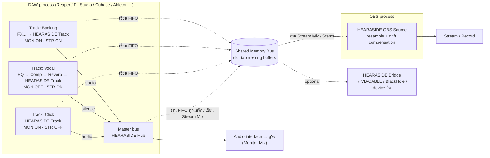

# HEARASIDE — แผนพัฒนาปลั๊กอิน VST3 / VST2 แยก "เสียงที่เราได้ยิน" กับ "เสียงที่คนดูได้ยิน" ส่งตรงเข้า OBS

> **ชื่อ "HEARASIDE" เป็นชื่อชั่วคราว** (ตรวจเครื่องหมายการค้าก่อนเผยแพร่จริง)
> เอกสารเวอร์ชัน 0.2 (Draft) · 7 ต.ค. 2026 — เพิ่ม UI/UX Design Plan เต็มรูปแบบ (หัวข้อ 7)
> แบบร่างหน้าตาปลั๊กอิน: [HEARASIDE Plugin UI (canvas)](https://claude.ai/artifact/XBmnEHccnFeKwSsGLtkbTd)

---

## สารบัญ

0. [สรุปสั้น (TL;DR)](#0-สรุปสั้น-tldr)
1. [เป้าหมายและขอบเขต](#1-เป้าหมายและขอบเขต)
2. [ตัวอย่างการใช้งาน (Routing Recipes)](#2-ตัวอย่างการใช้งาน-routing-recipes)
3. [ข้อจำกัดของระบบเสียง และทางเลือกสถาปัตยกรรม](#3-ข้อจำกัดของระบบเสียง-และทางเลือกสถาปัตยกรรม)
4. [สถาปัตยกรรมระบบ](#4-สถาปัตยกรรมระบบ)
5. [การตัดสินใจทางเทคนิค และเรื่อง License](#5-การตัดสินใจทางเทคนิค-และเรื่อง-license)
6. [รายละเอียดการออกแบบแต่ละส่วน](#6-รายละเอียดการออกแบบแต่ละส่วน)
7. [UI/UX Design Plan](#7-uiux-design-plan)
8. [หมายเหตุความเข้ากันได้กับ DAW แต่ละตัว](#8-หมายเหตุความเข้ากันได้กับ-daw-แต่ละตัว)
9. [โครงสร้าง Repository](#9-โครงสร้าง-repository)
10. [แผนงานเป็นเฟส (Milestones)](#10-แผนงานเป็นเฟส-milestones)
11. [แผนการทดสอบ](#11-แผนการทดสอบ)
12. [ความเสี่ยงและวิธีรับมือ](#12-ความเสี่ยงและวิธีรับมือ)
13. [การแพ็กเกจและติดตั้ง](#13-การแพ็กเกจและติดตั้ง)
14. [Roadmap ในอนาคต](#14-roadmap-ในอนาคต)
15. [คำถามที่ต้องตัดสินใจก่อนเริ่ม](#15-คำถามที่ต้องตัดสินใจก่อนเริ่ม)
16. [ภาคผนวก: อภิธานศัพท์ และแหล่งอ้างอิง](#16-ภาคผนวก-อภิธานศัพท์-และแหล่งอ้างอิง)

---

## 0. สรุปสั้น (TL;DR)

ระบบมี 3 ชิ้นหลัก + 1 ชิ้นเสริม:

| ชิ้นส่วน | อยู่ที่ไหน | หน้าที่ |
|---|---|---|
| **HEARASIDE Track** (VST3/VST2) | Insert ท้ายสุดของ FX chain ในแต่ละแทร็ก | มีสวิตช์อิสระ 2 ตัว: **MON** (ให้เสียงผ่านออก DAW ไปหูฟังเราไหม) และ **STR** (ส่งไปให้คนดูไหม) |
| **HEARASIDE Hub** (VST3/VST2) | Insert บน Master bus (ตัวเดียวต่อโปรเจกต์) | เป็น "นาฬิกากลาง" รวมเสียงทุกแทร็กที่เปิด STR เป็น **Stream Mix**, หน้าจอ mixer กลางคุมทุกแทร็ก, limiter, meter, scene, ปุ่ม Panic |
| **HEARASIDE OBS Source** | ปลั๊กอินฝั่ง OBS (Audio Source) | อ่าน Stream Mix จาก shared memory ส่งเข้า OBS โดยตรง ไม่ต้องลง virtual cable |
| *HEARASIDE Bridge* (เสริม) | แอปเล็ก ๆ บน tray | ส่ง Stream Mix ออก audio device ใดก็ได้ (VB-CABLE / BlackHole) สำหรับโปรแกรมที่ไม่ใช่ OBS |

หลักคิด:

- **Monitor Mix (เสียงที่เราได้ยิน)** = output ปกติของ DAW (Master → audio interface → หูฟัง) แทร็กที่ปิด MON ปลั๊กอินจะส่ง "ความเงียบ" ออกไปแทน
- **Stream Mix (เสียงที่คนดูได้ยิน)** = ผลรวมของแทร็กที่เปิด STR ซึ่ง Hub คำนวณแยกต่างหาก มี gain / pan / delay ของตัวเอง ไม่ขึ้นกับ fader ของ DAW
- **เคสหลักที่ต้องการ:** แทร็กร้อง `MON = OFF, STR = ON` → คนดูได้ยินเสียงร้องที่ผ่าน EQ/Comp/Reverb แล้ว แต่ในหูฟังเราไม่ได้ยินเสียงตัวเอง

เทคโนโลยี: C++20 + JUCE 8 + CMake, สื่อสาร DAW ↔ OBS ผ่าน **shared memory + lock-free ring buffer**, ฝั่ง OBS ชดเชย clock drift ด้วย **adaptive resampling**

หน้าตา: แนว **"Frosted Studio"** — โมโนโครม ขาว ดำ เทา การ์ดกระจกขุ่นบนพื้นกระดาษมีเส้นตาราง ใช้ภาษาคนแทนศัพท์เทคนิค (MON/STR บนจอคือ **"คุณได้ยิน" / "คนดูได้ยิน"**) และวาดแบบ native ใน JUCE (หัวข้อ 7)

> ⚠️ **VST2:** Steinberg หยุดออก license VST2 SDK ตั้งแต่ปี 2018 → วางแผนทำ **VST3 เป็นหลัก** ส่วน VST2 ทำได้เฉพาะเมื่อมี license เดิมอย่างถูกต้อง (ดูหัวข้อ 5.2)

---

## 1. เป้าหมายและขอบเขต

### 1.1 ปัญหาที่ต้องการแก้

วิธีส่งเสียง DAW เข้า OBS ทั่วไป (Desktop Audio, virtual cable จาก Master, Loopback) ส่ง **mix เดียวกับที่เราได้ยิน** ออกไป ทำให้:

- ถ้าเราไม่อยากได้ยินเสียงร้องตัวเองในหูฟัง → คนดูก็ไม่ได้ยินไปด้วย
- ถ้าเราต้องฟัง click / ไกด์ / เมโทรนอม → คนดูก็ได้ยินด้วย
- ปรับ balance ให้คนดูแยกจากที่เราฟังไม่ได้

สิ่งที่ต้องการคือ **2 mix ที่เป็นอิสระต่อกัน** โดยเลือกได้ระดับแทร็ก

### 1.2 User Stories

1. ในฐานะนักร้องที่ไลฟ์ ฉันอยากให้คนดูได้ยินเสียงร้องที่มิกซ์แล้ว แต่ในหูฟังฉันได้ยินแค่ดนตรี
2. ฉันอยากได้ยิน click / ไกด์เมโลดี้ แต่คนดูไม่ได้ยิน
3. ฉันอยากปรับระดับเสียงฝั่งคนดูแยกจาก fader ที่ฉันใช้ฟังเอง
4. ฉันอยากกดปุ่มเดียวสลับโหมด "ร้อง" / "คุย" / "พักจอ"
5. ฉันอยากกดฟังได้ทันทีว่า "ตอนนี้คนดูได้ยินอะไรอยู่" (Stream Preview)
6. ฉันอยากมีปุ่ม Panic ตัดเสียงไปหาคนดูทั้งหมดในคลิกเดียว
7. ฉันอยากให้ OBS อัดแยกแทร็ก เช่น VOD ที่ไม่มีเพลงลิขสิทธิ์

### 1.3 Goals (v1)

- VST3 บน Windows x64 และ macOS (Universal: arm64 + x86_64); VST2 ถ้ามี license
- สวิตช์ MON / STR อิสระต่อแทร็ก, automate ได้, บันทึกไปกับโปรเจกต์ DAW
- UI ภาษาไทย / อังกฤษ ที่ผู้ใช้ไม่ต้องรู้ศัพท์ audio ก็ตอบได้ใน 3 วินาทีว่า "ตอนนี้คนดูได้ยินอะไร" (เกณฑ์ใน 7.14)
- Stream Mix ไป OBS ผ่าน OBS Source plugin; มีทางสำรองผ่าน virtual audio device
- latency DAW → OBS ≤ ~50 ms ที่ค่า default
- ทุกแทร็กใน Stream Mix ตรงกันระดับ sample (ภายใต้เงื่อนไขในหัวข้อ 6.4)
- ไม่มีเสียงสะดุด (glitch) ใน soak test 4 ชั่วโมง
- กินทรัพยากรต่ำ: Track instance ไม่ควรเพิ่ม DSP load ที่สังเกตได้, Hub ที่ 64 แทร็ก < 2% ของ 1 core

### 1.4 Non-goals (v1)

- วิดีโอทุกรูปแบบ
- ส่งข้ามเครื่องผ่านเครือข่าย (อนาคต: NDI / UDP)
- AAX / Pro Tools, AU / Logic (อนาคต — JUCE รองรับ แต่ไม่อยู่ใน v1)
- Linux (stretch goal)
- PDC อัตโนมัติข้ามแทร็กใน Stream Mix (v1 ทำแบบตั้งค่า delay เอง)
- เอฟเฟกต์ซับซ้อนบน Stream bus (v1 มีแค่ gain + limiter)

---

## 2. ตัวอย่างการใช้งาน (Routing Recipes)

### 2.1 ความหมายของ 4 สถานะ

| MON | STR | ความหมาย | ใช้กับ |
|:---:|:---:|---|---|
| ON | ON | ทั้งเราและคนดูได้ยิน | backing track, เครื่องดนตรี |
| ON | OFF | เราได้ยินคนเดียว | click, ไกด์, talkback กับทีมงาน |
| **OFF** | **ON** | **คนดูได้ยินคนเดียว** | **เสียงร้อง/เสียงพูดของตัวเอง** |
| OFF | OFF | เงียบทั้งคู่ (แต่ยังอัดได้ เพราะ DAW อัด input ก่อนเข้า FX) | ไมค์สำรอง, แทร็กที่ยังไม่ใช้ |

### 2.2 Recipe A — ร้องเพลง cover / คาราโอเกะ (เคสหลัก)

| แทร็ก | MON | STR | หมายเหตุ |
|---|:---:|:---:|---|
| Backing | ON | ON | STR gain −3 dB ให้เสียงร้องเด่นขึ้นในฝั่งคนดู |
| Vocal (EQ → Comp → Reverb → **Track**) | **OFF** | **ON** | ใส่ Reverb เป็น insert ก่อน Track plugin |
| Click / Guide | ON | OFF | |

ข้อควรทำ:

1. **ปิด Direct Monitoring บน audio interface** — ไม่งั้นได้ยินเสียงตัวเองจาก hardware โดยไม่ผ่าน DAW
2. **เปิด Input Monitoring ของแทร็กร้องใน DAW** (เช่น Auto / In) — เสียงต้อง "ไหลผ่าน" FX และปลั๊กอิน แล้วให้ปลั๊กอินเป็นคนปิดเสียงในหูฟังแทน ถ้าปิด input monitoring ใน DAW เสียงจะไม่ถึงปลั๊กอินเลย คนดูก็ไม่ได้ยิน
3. ถ้าใช้ Reverb แบบ send/return: เมื่อ MON = OFF ปลั๊กอินส่งความเงียบ send ที่อยู่หลังมันจึงเงียบด้วย → ให้ใส่ Reverb เป็น insert **ก่อน** Track plugin หรือทำ Vocal Bus (vocal + reverb return) แล้วใส่ Track plugin ที่ Vocal Bus แทน

### 2.3 Recipe B — เล่นกีตาร์ + คุยกับคนดู

| แทร็ก | MON | STR |
|---|:---:|:---:|
| Guitar | ON | ON |
| Mic พูด | OFF | ON |
| Backing | ON | ON |

สร้าง Scene "คุย" (Mic STR gain +3 dB, Backing STR gain −10 dB) กับ Scene "เล่น" แล้วสลับด้วยปุ่มหรือ MIDI

### 2.4 Recipe C — VOD ปลอดเพลงลิขสิทธิ์

- Backing: MON ON, STR ON, **Stem = "BGM"**
- Vocal: MON OFF, STR ON, **Stem = "Vox"**
- ใน OBS: Source "Stream Mix" → Track 1 (ไลฟ์), Source "Stem: Vox" → Track 2 (ตั้งเป็น VOD track) → VOD มีแต่เสียงร้อง

### 2.5 Recipe D — เมโทรนอมของ DAW

เมโทรนอมในตัว DAW ส่วนใหญ่วิ่งตรงไป output โดยไม่ผ่านแทร็ก → **ไม่มีทางหลุดไปหาคนดูโดยอัตโนมัติ** เพราะ Stream Mix รับเฉพาะแทร็กที่มี Track plugin เท่านั้น

---

## 3. ข้อจำกัดของระบบเสียง และทางเลือกสถาปัตยกรรม

### 3.1 ข้อจำกัดที่ต้องรู้ก่อนออกแบบ

1. **ปลั๊กอิน insert เห็นเสียงแค่แทร็กของตัวเอง** ไม่เห็น mixer ทั้งหมด → ต้องมีหลาย instance ที่คุยกันได้
2. **ASIO บน Windows ส่วนใหญ่ใช้ได้ทีละโปรแกรม** → ปลั๊กอินเปิด audio interface ซ้ำเพื่อทำ monitor mix เองไม่ได้ → Monitor Mix ต้องใช้ output ปกติของ DAW
3. **OBS "Application Audio Capture" จับได้เฉพาะเสียงที่ออกทาง WASAPI** → จับเสียง DAW ที่ใช้ ASIO ไม่ได้
4. **DAW กับ OBS อยู่คนละโปรเซส และใช้นาฬิกาเสียงคนละตัว** (DAW ใช้ clock ของ audio interface, OBS ใช้ system clock) → ต้องมี IPC และต้องชดเชย drift ไม่งั้นเสียงจะค่อย ๆ เลื่อนจนสะดุด
5. **DAW บางตัวประมวลผลแทร็กล่วงหน้า** (Reaper Anticipative FX, Cubase ASIO-Guard ฯลฯ) และ **PDC** ถูกใส่หลัง insert → กระทบการ sync ระหว่างแทร็ก (รายละเอียดหัวข้อ 6.4 และ 8)

### 3.2 ทางเลือกที่พิจารณา

**Option 1 — ใช้ routing ของ DAW + ปลั๊กอินส่งออกตัวเดียว**
สร้าง "Stream Bus" ใน DAW, แต่ละแทร็กทำ send ไปที่ bus นี้, ใส่ปลั๊กอิน "Send to OBS" ที่ Stream Bus แล้วตัด output ของ bus ไม่ให้เข้า Master (แนวเดียวกับ ReaStream / VB-CABLE)

**Option 2 — Track insert + Hub + OBS Source ✅ (เลือก)**
ปลั๊กอินบนทุกแทร็ก ส่งเสียงเข้า shared memory, Hub บน Master เป็นตัวรวมและเป็นนาฬิกา, OBS อ่านผ่านปลั๊กอินของตัวเอง

**Option 3 — มิกซ์ใน OBS**
ส่งแต่ละแทร็กออก output คนละช่องผ่าน loopback ASIO driver แล้วรับหลายช่องใน OBS (เช่น obs-asio) แล้วมิกซ์ในตัว OBS

| เกณฑ์ | Option 1 | **Option 2** | Option 3 |
|---|---|---|---|
| ความง่ายในการตั้งค่าครั้งแรก | ปานกลาง (ต้อง routing เองทุก DAW) | **ง่าย (ลากปลั๊กอินใส่)** | ยาก |
| หน้าจอคุมรวมที่เดียว | ไม่มี | **มี** | มี (ใน OBS) |
| PDC ถูกต้อง | ✅ DAW จัดการให้ | ⚠️ ต้องตั้ง delay เอง | ⚠️ |
| Post-fader / send FX | ✅ | ⚠️ pre-fader (มี gain ของตัวเอง) | ✅ |
| ต้องลง driver เพิ่ม | อาจต้อง | **ไม่ต้อง** | ต้อง |
| Scene / Panic / Preview | ไม่มี | **มี** | บางส่วน |

**เหตุผลที่เลือก Option 2:** ตอบโจทย์ "เลือกแทร็กเองได้ง่าย ๆ จากที่เดียว" ได้ดีที่สุด และ **ครอบคลุม Option 1 ไปด้วย** — ผู้ใช้ที่อยากได้ PDC/post-fader แบบสมบูรณ์ สามารถสร้าง bus ใน DAW แล้วใส่ Track plugin ที่ bus นั้นได้เลย

---

## 4. สถาปัตยกรรมระบบ

### 4.1 ภาพรวม



### 4.2 สิ่งที่เกิดขึ้นในหนึ่ง audio cycle

1. DAW เรียก `process()` ของทุกแทร็ก (อาจขนานกันหลาย thread)
2. **Track instance** ในแต่ละแทร็ก:
   - (ก) เขียนเสียง post-FX ลง FIFO ของ slot ตัวเองใน shared memory **ทุกครั้ง** (Hub เป็นคนตัดสินว่าจะเข้า Stream Mix หรือไม่ — จุดตัดสินมีที่เดียว)
   - (ข) ส่ง output กลับให้ DAW = input × monitor gain → ถ้า MON = OFF จะค่อย ๆ ramp เป็นความเงียบภายใน ~10 ms
3. DAW รวมทุกแทร็กไปที่ Master → **Hub** ทำงาน:
   - ดึงเสียงจำนวนเท่ากับ block ปัจจุบัน (n samples) จาก FIFO ของทุก slot ที่ active
   - ใส่ STR on/off, gain, pan, delay (พร้อม smoothing) → รวมเป็น Stream Mix
   - Stream master gain → limiter → เขียนลง Stream Ring (+ Stem Rings)
   - output ของ Hub = input ของ Master ตามปกติ (หรือ = Stream Mix ตอนกด Preview)
4. **OBS Source** มี thread ของตัวเองตื่นทุก ~10 ms อ่าน Stream Ring → resample (ชดเชย drift + แปลง sample rate) → `obs_source_output_audio()`

### 4.3 ทำไมแทร็กถึงตรงกันระดับ sample

Master **ขึ้นกับ** ทุกแทร็กที่ route มาหามัน DAW จึงต้องประมวลผลแทร็กเหล่านั้นให้เสร็จก่อน Master ในทุก cycle ดังนั้นตอนที่ Hub ทำงาน FIFO ของทุกแทร็กมีข้อมูลใหม่ "เท่ากันพอดี" กับที่ Hub จะดึง → ถ้า Hub ดึงตามจำนวน sample (ไม่ใช่ตามจำนวนครั้งที่ถูกเรียก) ก็จะตรงกันเสมอ แม้ host จะแบ่ง block เป็นขนาดไม่เท่ากัน (เช่น FL Studio)

เงื่อนไขและข้อยกเว้นของสมมติฐานนี้ (ahead processing, PDC, แทร็กที่ไม่ได้ route เข้า Master) อยู่ในหัวข้อ 6.4 และต้อง **พิสูจน์ด้วย spike test ในเฟส 0** ก่อนลงมือจริง

---

## 5. การตัดสินใจทางเทคนิค และเรื่อง License

### 5.1 Tech Stack

| ส่วน | เลือก | เหตุผล |
|---|---|---|
| ภาษา | C++20 | มาตรฐานของงาน audio plugin, มี `std::atomic`, `std::span` |
| Build | CMake ≥ 3.25 + Ninja | JUCE และ OBS ใช้ CMake ทั้งคู่ |
| Plugin framework | **JUCE 8** | VST3 / VST2 / AU / Standalone จาก codebase เดียว, มี `TrackProperties` (ชื่อ+สีแทร็ก), มี pluginval |
| CLAP (เสริม) | clap-juce-extensions | รูปแบบเปิดที่ทดแทน VST2 ได้ในหลาย host |
| Core IPC library | C++ ล้วน **ไม่พึ่ง JUCE** | ให้ OBS plugin และ Bridge link ได้ด้วย |
| OBS plugin | obs-plugintemplate + libobs | template ทางการของ OBS พร้อม CI |
| Resampler | speexdsp resampler (BSD) | ปรับ ratio แบบละเอียดระหว่างทำงานได้ (`speex_resampler_set_rate_frac`) |
| Audio I/O (Bridge) | miniaudio (MIT-0 / Public Domain) | single-header, รองรับ WASAPI / CoreAudio |
| Test | Catch2 + pluginval + VST3 validator | unit + การตรวจมาตรฐานปลั๊กอิน |
| CI | GitHub Actions (windows-latest, macos-latest) | build + test + artifact |
| Installer | Inno Setup (Win), pkgbuild/productbuild (mac) | |

เทียบ framework คร่าว ๆ:

| | JUCE 8 | iPlug2 | DPF | VST3 SDK ตรง ๆ |
|---|---|---|---|---|
| VST3 | ✅ | ✅ | ✅ | ✅ |
| VST2 (ต้องมี SDK ที่ถูกสิทธิ์) | ✅ | ✅ | มี header ของตัวเอง (ระวังเรื่องสิทธิ์) | ❌ |
| UI toolkit ในตัว | ✅ ครบ | ✅ | พื้นฐาน | ❌ ต้องทำเอง |
| ชื่อ/สีแทร็กจาก host | ✅ `updateTrackProperties` | บางส่วน | บางส่วน | ✅ `IInfoListener` |
| Community / เอกสาร | มากที่สุด | ปานกลาง | ปานกลาง | ทางการ |
| License | AGPLv3 หรือ commercial | zlib-like | ISC | MIT (3.8+) |

### 5.2 License และข้อกฎหมายที่ต้องระวัง

> ไม่ใช่คำแนะนำทางกฎหมาย — ถ้าจะขายหรือแจกจ่ายในวงกว้าง ควรตรวจกับผู้รู้

- **VST3 SDK:** ตั้งแต่ VST 3.8 (ต.ค. 2025) Steinberg เปลี่ยนเป็น MIT License ใช้งานสะดวกขึ้นมาก — ตรวจเงื่อนไขล่าสุดใน repo `steinbergmedia/vst3sdk` อีกครั้งก่อนเริ่ม; การใช้โลโก้ "VST" ยังมี usage guideline แยก
- **VST2:** Steinberg หยุดแจก VST2 SDK และหยุดเซ็น license ใหม่ตั้งแต่ ต.ค. 2018 → แจกจ่าย VST2 ได้เฉพาะผู้ที่เซ็นสัญญาไว้ก่อนหน้า **ไม่ควรใช้ header ที่ไม่มีสิทธิ์** กับผลงานที่จะเผยแพร่
  - **แนะนำ:** ปล่อย VST3 (+ CLAP) ก่อน DAW หลักเกือบทั้งหมดรองรับ VST3 แล้ว ค่อยทำ VST2 ถ้ามี license และมี host ที่จำเป็นจริง
  - ออกแบบโค้ดให้ VST2 เป็นแค่ "อีก 1 format" ใน `juce_add_plugin(FORMATS ...)` จะได้เปิดภายหลังได้ทันที
- **JUCE 8:** dual license — AGPLv3 หรือ commercial (มี tier เริ่มต้นตามเพดานรายได้ ตรวจเงื่อนไขปัจจุบันบนเว็บ JUCE)
- **OBS:** GPLv2 → OBS plugin ต้องเป็น GPL-compatible (เปิด source) ส่วน VST plugin ทำงานคนละโปรเซสและคุยผ่าน protocol ของเราเอง
- **Core IPC library:** เราเป็นเจ้าของเอง → ตั้งเป็น MIT เพื่อให้ link ได้ทั้งฝั่ง OBS (GPL) และฝั่ง VST
- **speexdsp** (BSD), **miniaudio** (MIT-0) — ใช้ได้ทั้งเชิงพาณิชย์และ GPL

---

## 6. รายละเอียดการออกแบบแต่ละส่วน

### 6.1 Shared Memory Bus

#### การตั้งชื่อและการเปิด

| OS | API | ชื่อ |
|---|---|---|
| Windows | `CreateFileMappingW(INVALID_HANDLE_VALUE, …, PAGE_READWRITE, …)` + `MapViewOfFile` | `Local\HEARASIDE_v1_<BusName>` |
| macOS | `shm_open` + `ftruncate` + `mmap` | `/hrsd1_<hash(BusName)>` (macOS จำกัดชื่อ ~31 ตัวอักษร จึงใช้ hash) |

- **BusName** (default `Main`) ตั้งได้ในทุกชิ้นส่วน ใช้แยกกรณีเปิด DAW 2 ตัวหรือหลายโปรเจกต์พร้อมกัน
- **ใส่เลข protocol version ในชื่อ** (`_v1`) → ปลั๊กอินต่างเวอร์ชันไม่ชนกัน
- **Windows + Run as administrator:** object ที่โปรเซส elevated สร้าง อาจถูกโปรเซสปกติเปิดเขียนไม่ได้ (integrity level ต่างกัน) และผู้ใช้ OBS จำนวนมากรัน OBS แบบ admin → สร้าง mapping พร้อม security descriptor ที่อนุญาตทั้ง medium/high integrity และใส่ใน test matrix ทุกกรณี (DAW admin / OBS admin / ไม่มีใคร admin)

#### Layout (protocol v1)

```
offset     ขนาด                        ส่วน
0          4 KB                        BusHeader
4 KB       64 × 1 KB                   SlotHeader[64]
68 KB      64 × 2ch × 32768 × 4 B      SlotAudio[64]        (~16 MB, ~680 ms @48k ต่อแทร็ก)
...        4 KB                        StreamOutHeader
...        9 × 2ch × 32768 × 4 B       StreamOutAudio[1+8]  (Stream Mix + 8 stems, ~2.3 MB)
รวม ≈ 19 MB (ค่าคงที่ทั้งหมดอยู่ใน protocol.h)
```

#### โครงสร้างข้อมูล (ร่าง)

```cpp
// libs/ssbus/include/ssbus/protocol.h
namespace ssbus {
constexpr uint32_t kMagic           = 0x53535031; // 'SSP1'
constexpr uint32_t kProtocolVersion = 1;
constexpr int      kMaxSlots        = 64;
constexpr int      kMaxStems        = 8;
constexpr uint32_t kRingFrames      = 32768;      // ต้องเป็น power of 2
constexpr int      kMailboxSize     = 16;

static_assert(std::atomic<uint64_t>::is_always_lock_free);
static_assert(std::atomic<uint32_t>::is_always_lock_free);

struct alignas(64) BusHeader {
    std::atomic<uint32_t> magic;          // เขียนเป็นอย่างสุดท้ายตอน init (release)
    uint32_t              version;
    uint32_t              layoutSize;     // ตรวจว่า struct ตรงกันทั้งสองฝั่ง
    std::atomic<uint32_t> hubOwnerPid;    // มี Hub ได้ตัวเดียวต่อ bus
    std::atomic<uint64_t> hubHeartbeatNs;
    std::atomic<uint32_t> hubSampleRate;
    std::atomic<uint32_t> hubFlags;       // bypassed, preview, panic ...
};

struct Command { uint32_t paramId; float value; };

struct alignas(64) SlotHeader {
    std::atomic<uint32_t> state;          // 0 Free, 1 Claiming, 2 Active
    std::atomic<uint32_t> epoch;          // +1 เมื่อ reset/เปลี่ยน sample rate/transport jump
    uint32_t              ownerPid;
    char                  uuid[40];
    char                  name[64];       // UTF-8
    uint32_t              colorRGBA;
    std::atomic<uint32_t> sampleRate;
    std::atomic<uint32_t> numChannels;    // 1 หรือ 2
    std::atomic<uint64_t> heartbeatNs;

    // กระจกของพารามิเตอร์ (Track เขียน, Hub อ่าน) — float เก็บเป็น bit pattern ใน uint32
    std::atomic<uint32_t> flags;          // bit0 MON, bit1 STR, bit2 SOLO
    std::atomic<uint32_t> streamGainBits;
    std::atomic<uint32_t> streamPanBits;
    std::atomic<uint32_t> streamDelaySamples;
    std::atomic<int32_t>  stemIndex;      // -1 = ไม่ส่ง stem

    // คำสั่งจาก Hub → Track (ring เล็ก ๆ, Hub UI เขียน, Track UI timer อ่าน)
    std::atomic<uint32_t> cmdWrite;
    Command               cmds[kMailboxSize];

    // meter
    std::atomic<uint32_t> peakMonitorBits[2];
    std::atomic<uint32_t> peakStreamBits[2];  // Hub เขียน (post-gain)

    // ring buffer ของเสียง
    alignas(64) std::atomic<uint64_t> writePos;   // นับเป็น frame แบบ monotonic
};
} // namespace ssbus
```

#### การ init และวงจรชีวิต

- **สร้างพร้อมกันหลายตัว (race):** ตัวแรกที่สร้าง (Windows: `GetLastError() != ERROR_ALREADY_EXISTS`, macOS: `O_CREAT | O_EXCL`) เป็นคน zero + placement-new ทุก struct แล้วเขียน `magic` เป็นอย่างสุดท้ายด้วย `memory_order_release`; ตัวอื่นรอ `magic` สูงสุด ~200 ms ถ้าไม่มาให้ถือว่าเสีย แล้วรายงาน error
- **ตรวจ `version` และ `layoutSize`** ทุกครั้งที่เปิด ถ้าไม่ตรง → ไม่ใช้ และแสดงข้อความ "เวอร์ชันไม่ตรงกัน"
- **เปิด/map ใน message thread เท่านั้น** (constructor / `prepareToPlay`) ห้ามทำใน audio thread
- **อายุของ segment:** Windows หายเองเมื่อทุกโปรเซสปิด handle; macOS คงอยู่จนกว่าจะ `shm_unlink` → ไม่ unlink เอง ใช้ heartbeat จัดการสถานะค้างแทน

#### การจอง Slot

1. หา slot `Free` แล้ว CAS `Free → Claiming`
2. เขียน uuid, name, sampleRate, ownerPid
3. `state = Active` (release) → Hub เริ่มเห็น
4. destructor ของปลั๊กอิน: `state = Free`
5. **กู้ slot ค้าง:** ถ้า heartbeat เก่ากว่า 5 วินาที **และ** owner process ตายแล้ว (Windows: `OpenProcess` + `WaitForSingleObject(h, 0)`, macOS: `kill(pid, 0)`) → Hub คืน slot เป็น `Free`; ถ้า process ยังอยู่แต่ไม่มี heartbeat = แทร็กถูก suspend → เก็บ slot ไว้ แสดงเป็น "inactive"
6. **UUID ซ้ำ:** เมื่อผู้ใช้ duplicate แทร็ก DAW จะคัดลอก state ทำให้ UUID ซ้ำ → ตอนจอง slot ถ้าเจอ UUID เดียวกันใน slot ที่ active อยู่ ให้สร้าง UUID ใหม่ให้ตัวเอง (และ mark state เป็น dirty ให้ host บันทึก)

### 6.2 Broadcast Ring Buffer (lock-free, 1 writer หลาย reader)

ใช้กับทั้ง FIFO ของแต่ละแทร็กและ Stream/Stem ring

- **writer ไม่เคยรอ reader** — DAW ห้ามสะดุดเพราะ OBS ค้างเด็ดขาด
- **reader เก็บ cursor ของตัวเองแบบ private** → มี reader หลายตัวพร้อมกันได้ (OBS 2 source, Bridge, เครื่องมือ debug)
- เสียงเก็บแบบ planar float, buffer แต่ละช่อง align 64 bytes
- `writePos` เป็นตัวนับ frame 64-bit ไม่มีวันวนกลับ → คำนวณ index ด้วย `pos & (kRingFrames - 1)`

```cpp
// writer (audio thread ของ Track / Hub)
void write(const float* const* src, uint32_t ch, uint32_t n) {
    uint64_t w = writePos.load(std::memory_order_relaxed);   // writer มีคนเดียว
    for (uint32_t c = 0; c < ch; ++c) copyWrapped(ring[c], w, src[c], n);
    writePos.store(w + n, std::memory_order_release);
}

// reader (Hub หรือ OBS)
ReadResult read(uint64_t& r, float* const* dst, uint32_t ch, uint32_t n) {
    uint64_t w = writePos.load(std::memory_order_acquire);
    if (w - r > kRingFrames - kGuardFrames) return Overrun;   // ถูกเขียนทับแล้ว → ให้ caller resync
    uint32_t avail = uint32_t(std::min<uint64_t>(w - r, n));
    for (uint32_t c = 0; c < ch; ++c) copyWrapped(dst[c], ring[c], r, avail);
    uint64_t w2 = writePos.load(std::memory_order_acquire);   // ตรวจซ้ำว่าระหว่าง copy โดนทับไหม
    if (w2 - r > kRingFrames - kGuardFrames) return Overrun;
    r += avail;
    return avail == n ? Ok : Underrun;                         // ส่วนที่ขาดให้ caller เติม 0
}
```

### 6.3 HEARASIDE Track (ปลั๊กอินประจำแทร็ก)

#### Bus layout

- รองรับ mono→mono และ stereo→stereo (input = output)
- แทร็ก mono ส่งเข้า Stream Mix แบบ dual-mono แล้วใช้ pan ของ Stream
- รายงาน latency = 0 เสมอ

#### พารามิเตอร์ (automate ได้ บันทึกไปกับโปรเจกต์)

| ID | ชื่อ | ช่วง | Default | หมายเหตุ |
|---|---|---|---|---|
| `mon` | Monitor | Off / On | On | ให้เสียงออก DAW ไหม |
| `str` | Stream | Off / On | On | ให้เข้า Stream Mix ไหม |
| `strGain` | Stream Gain | −∞ … +12 dB | 0 dB | ไม่ขึ้นกับ fader DAW |
| `strPan` | Stream Pan/Balance | L100 … R100 | C | |
| `strDelay` | Stream Delay | 0 … 500 ms | 0 | ชดเชย PDC / latency ของ live input (เช่น ปลั๊กอินร้องหน่วง 40 ms → ตั้งแทร็กดนตรี 40 ms) — มีผลเฉพาะฝั่งคนดู หูฟังไม่ช้าลง |
| `monTrim` | Headphone Level ("ระดับในหูฟัง") | −∞ … +6 dB | 0 dB | ลดเสียงแทร็กนี้ในหูฟังโดยคนดูยังได้ยินเท่าเดิม (Stream Mix อ่านก่อน gain นี้) แสดงบนหน้าจอหลักของ Track และในแถวของ Hub |
| `strSolo` | Stream Solo | Off / On | Off | solo ในฝั่ง Stream เท่านั้น |

ชื่อที่ผู้ใช้เห็นบนจอ: `mon` → "คุณได้ยิน", `str` → "คนดูได้ยิน", `strGain` → "ระดับเสียงฝั่งคนดู" (ทั้งหมดอยู่ในหัวข้อ 7.8) — ส่วนชื่อพารามิเตอร์ที่ host เห็น (automation lane) ใช้ภาษาอังกฤษสั้น ๆ: "You Hear", "Viewers Hear", "Viewers Level"

State ที่ไม่ใช่พารามิเตอร์: `uuid`, `displayName` (override ชื่อ), `color` (override), `busName`, `stemIndex`

> **การตัดสินใจ:** เก็บค่าการ routing ไว้ใน Track instance ของแต่ละแทร็ก (ไม่ใช่ใน Hub) เพราะ (1) automate ต่อแทร็กได้เป็นธรรมชาติ (2) ลบ/ย้าย/copy แทร็กแล้ว setting ตามไปด้วย (3) แม้ Hub หายไป setting ก็ไม่หาย — Hub เป็นแค่ "รีโมต"

#### process() (pseudo code)

```cpp
void processBlock(AudioBuffer<float>& buf, MidiBuffer&) {
    juce::ScopedNoDenormals noDenormals;
    const int n = buf.getNumSamples();
    if (n == 0) return;                       // VST3 อาจเรียกด้วย 0 sample เพื่อ flush parameter

    if (! isNonRealtime() && slot != nullptr) {   // ไม่ส่งออกระหว่าง export/bounce แบบ offline
        slot->heartbeatNs.store(nowNs(), std::memory_order_relaxed);
        publishTimelineTag(n);                // เก็บตำแหน่ง playhead ของ block นี้ (ดู 6.4)
        ring.write(buf.getArrayOfReadPointers(), buf.getNumChannels(), n);
        mirrorParamsToSlot();                 // atomic store ค่า mon/str/gain/pan/delay
        updatePeakMeters(buf);
    }

    const float target = monParam->get() ? dbToGain(monTrim->get()) : 0.0f;
    monitorGain.setTargetValue(target);       // SmoothedValue, ramp ~10 ms กันเสียงคลิก
    monitorGain.applyGain(buf, n);
}
```

- `processBlockBypassed()`: เมื่อผู้ใช้ bypass host จะปล่อยเสียงผ่านตามปกติ → **ถ้า MON = OFF อยู่ การ bypass จะทำให้ได้ยินเสียงตัวเองกลับมา** → แสดงคำเตือนใน UI และในคู่มือ
- `prepareToPlay()`: เมื่อ sample rate / block size เปลี่ยน → อัปเดต `sampleRate` ใน slot และ `epoch++` ให้ Hub จัดตำแหน่งอ่านใหม่

#### ชื่อและสีแทร็ก

- VST3 (และ AU): รับผ่าน `updateTrackProperties(const TrackProperties&)` ของ JUCE (VST3 `IInfoListener`) → ได้ชื่อ + สีอัตโนมัติ และอัปเดตเมื่อผู้ใช้เปลี่ยนชื่อแทร็ก
- VST2: ไม่มีกลไกมาตรฐาน → ให้ผู้ใช้พิมพ์ชื่อเอง (default "Track 1, 2, …")

#### การรับคำสั่งจาก Hub (รีโมต)

1. Hub UI เขียน `Command{paramId, value}` ลง mailbox ของ slot แล้วเพิ่ม `cmdWrite`
2. Track มี `juce::Timer` ~30 Hz บน **message thread** ตรวจ `cmdWrite` ถ้ามีคำสั่งใหม่ →
   `param->beginChangeGesture(); param->setValueNotifyingHost(v); param->endChangeGesture();`
3. host จึงรู้การเปลี่ยนแปลง (undo / automation / save โปรเจกต์ทำงานถูกต้อง)
4. **ห้ามเปลี่ยนพารามิเตอร์จาก audio thread** และห้ามแก้ค่าข้าม instance โดยตรง
5. ถ้า Track UI ปิดอยู่ timer ก็ยังทำงานได้ เพราะผูกกับ processor ไม่ใช่ editor

### 6.4 HEARASIDE Hub

#### ตำแหน่งและข้อจำกัด

- ใส่เป็น **insert ตัวสุดท้ายของ Master bus** (ให้ปุ่ม Preview แทนที่ output สุดท้ายได้จริง)
- มีได้ **ตัวเดียวต่อ bus**: Hub ตัวแรกจอง `hubOwnerPid` ด้วย CAS; ตัวที่สองแสดง "มี Hub ทำงานอยู่แล้ว" และ passthrough เฉย ๆ
- ถ้า Hub ถูก bypass → Stream Mix เงียบ และ OBS Source แสดงสถานะ "Hub bypassed"

#### อัลกอริทึม sync (แกนสำคัญที่สุดของระบบ)

Hub เก็บ read cursor `r[s]` ของแต่ละ slot ไว้ใน memory ของตัวเอง ทุก `process(n)`:

```text
L = syncSafety × blockSize          // default 0; ตั้งเป็น 1–2 block ใน host ที่ลำดับไม่แน่นอน

for each slot s ที่ Active และ sampleRate ตรงกับ Hub:
    if s ใหม่ หรือ s.epoch เปลี่ยน หรือ ต้อง re-anchor:
        r[s] = anchorPosition(s)        // ดูด้านล่าง
    res = ring[s].read(r[s], tmp, n)
    if res == Underrun:                 // แทร็กไม่ถูกประมวลผลรอบนี้ (suspend / smart-disable)
        เติม 0 ส่วนที่ขาด, mark needReanchor[s]
    if res == Overrun:                  // Hub หยุดไปนาน / แทร็กวิ่งนำเกิน ring
        r[s] = anchorPosition(s), crossfade 5 ms
    lead = ring[s].writePos - r[s]      // ปกติควร ≈ L
    if lead > L + max(2n, 20 ms) ต่อเนื่อง > 1 วินาที:
        แสดงคำเตือน "แทร็กนี้ถูกประมวลผลล่วงหน้า (ahead processing)"
        // ไม่ re-anchor อัตโนมัติ เพราะใน host ที่ render ล่วงหน้า lead ที่สูงคือสภาพปกติที่ยังตรงกันอยู่
```

**`anchorPosition(s)`:**

1. ถ้า transport กำลังเล่น และ slot มี **timeline tag** (ตำแหน่ง playhead ของแต่ละ block ที่ Track บันทึกไว้ใน block-index ring เล็ก ๆ ข้าง FIFO) → หา frame ใน FIFO ที่ตรงกับตำแหน่ง playhead ปัจจุบันของ Hub แล้วตั้ง `r[s]` ที่นั่น (ถูกต้องแม้ host จะ render แทร็กล่วงหน้า)
2. ถ้าไม่มี tag (transport หยุด / live input) → `r[s] = writePos - n - L` (สมมติว่าแทร็กเขียน block ของรอบนี้ไปแล้ว)

**เหตุการณ์ที่บังคับ re-anchor ทุก slot:** Hub ตรวจพบ transport start/stop/seek จาก playhead ของตัวเอง, Hub เพิ่ง activate, sample rate เปลี่ยน

**ข้อยกเว้นที่ต้องรู้:**

| สถานการณ์ | ผล | วิธีรับมือ |
|---|---|---|
| แทร็กไม่ได้ route เข้า Master | ลำดับเทียบกับ Hub ไม่แน่นอน → อาจเหลื่อม 1 block | แนะนำให้ route เข้า Master เสมอ (ปลั๊กอินปิดเสียงฝั่ง monitor ให้อยู่แล้ว) หรือเพิ่ม `syncSafety` |
| Ahead processing (Reaper Anticipative FX, Cubase ASIO-Guard ฯลฯ) | backing ถูก render ล่วงหน้า | timeline tag + re-anchor ตอน transport เปลี่ยน; หรือปิด ahead processing ให้ปลั๊กอินนี้ |
| PDC: มีปลั๊กอินที่มี latency อยู่ **ก่อน** Track plugin | DAW ชดเชยหลัง insert เราจึงเห็นเสียงก่อนชดเชย | ใช้ `strDelay` กับแทร็กอื่น (อนาคต: ปุ่มวัด latency อัตโนมัติ) |
| แทร็ก freeze / ถูก disable | ปลั๊กอินไม่ทำงาน → ไม่มีใน Stream Mix | ระบุในคู่มือ + UI แสดง inactive |
| Export/Bounce (offline) | ไม่ส่งอะไรออก | ตรวจด้วย `isNonRealtime()` |

#### การรวมเสียง (ต่อ block)

```text
soloActive = มี slot ใดเปิด strSolo
for each slot s:
    g = (STR ? dbToGain(strGain) : 0) × (soloActive ? (solo ? 1 : 0) : 1) × (panic ? 0 : 1)
    gainSmoother[s].setTarget(g)                       // ramp 20 ms
    tmp = delayLine[s].process(tmp, strDelay)          // จองหน่วยความจำสูงสุดไว้ตอน prepare
    applyEqualPowerPan(tmp, strPan)
    mix  += tmp × gainSmoother[s]
    if stemIndex[s] >= 0: stem[stemIndex] += tmp × gainSmoother[s]
    peakStream[s] = peak(tmp × gain)

stream = mix × dbToGain(streamMaster)
stream = limiter(stream, ceiling = −1 dBFS, lookahead 1 ms)   // กันพีคหลุดไปหาคนดู
streamRing.write(stream); stemRings.write(stems)
loudnessMeter.process(stream)                                  // LUFS-M / LUFS-S ตาม ITU-R BS.1770
output = preview ? crossfade(input → stream, 20 ms) : input
```

#### พารามิเตอร์ของ Hub

| ID | ชื่อ | ช่วง | Default |
|---|---|---|---|
| `streamMaster` | Stream Master | −∞ … +12 dB | 0 dB |
| `limiterOn` | Limiter | Off / On | On |
| `ceiling` | Limiter Ceiling | −12 … 0 dBFS | −1 dBFS |
| `preview` | ฟังแบบคนดู (Preview) | Off / On | Off |
| `panic` | Stream Panic (ตัดเสียงคนดูทั้งหมด) | Off / On | Off |
| `syncSafety` | Sync Safety | 0 / 1 / 2 block | 0 |
| `scene` | Scene | 0 … 8 | 0 (ไม่ใช้) |
| `monitorMaster` | ระดับหูฟังรวม (Headphone Master) | −∞ … +6 dB | 0 dB — ลดทุกอย่างที่คุณได้ยิน (หลัง Stream Mix ถูกเขียนแล้ว) ไม่มีผลตอน export/bounce |

#### Scene

- เก็บได้ 8 scene ใน state ของ Hub; แต่ละ scene = map ของ `uuid → {mon, str, strGain, strPan, solo}`
- เรียก scene ได้จากปุ่ม, จากพารามิเตอร์ `scene` (จึง automate หรือ map MIDI/Stream Deck ผ่าน host ได้)
- การเรียก scene = Hub ส่งคำสั่งลง mailbox ของแต่ละ Track (Track เป็นคนแก้พารามิเตอร์ตัวเอง ตาม 6.3)
- แทร็กที่ไม่อยู่ใน scene (สร้างทีหลัง) → ไม่ถูกแตะ

### 6.5 HEARASIDE OBS Source

#### การลงทะเบียน

```c
struct obs_source_info hearaside_source = {
    .id             = "hearaside_source",
    .type           = OBS_SOURCE_TYPE_INPUT,
    .output_flags   = OBS_SOURCE_AUDIO,
    .get_name       = ss_get_name,
    .create         = ss_create,          // สร้าง reader thread
    .destroy        = ss_destroy,
    .update         = ss_update,
    .get_defaults   = ss_defaults,
    .get_properties = ss_properties,
};
```

#### Properties ที่ผู้ใช้เห็น

- **Bus name** (default `Main`)
- **Output:** Stream Mix / Stem 1–8 (แสดงชื่อ stem ที่ตั้งไว้ใน Hub)
- **Buffer:** Low (15 ms) / Normal (30 ms) / Safe (60 ms)
- **สถานะ:** Connected · DAW 48 kHz · buffer 29.8 ms · drift +12 ppm · underrun 0

#### Reader thread

```text
tick = 10 ms (OBS 48 kHz → output 480 frames ต่อ tick)
loop:
    os_sleepto_ns(next += tick)
    ถ้ายังไม่ได้เชื่อม shm → ลองเปิดทุก 1 วินาที, continue
    ถ้า hubHeartbeat เก่ากว่า 500 ms → สถานะ "ไม่มีสัญญาณ", หยุดส่ง (fade out 10 ms), continue
    ถ้าเพิ่งเชื่อม / overrun / sample rate เปลี่ยน → r = writePos − targetFrames, reset ตัวควบคุม
    fill  = writePos − r
    e     = lowpass((fill − target) / target)
    c     = clamp(Kp·e + Ki·∫e, ±0.005)          // ปรับได้ไม่เกิน ±0.5% ซึ่งหูไม่ได้ยิน
    ratio = (dawRate × (1 + c)) / obsRate        // ใช้ speex_resampler_set_rate_frac
    อ่าน input เท่าที่ resampler ต้องการเพื่อให้ได้ 480 frames พอดี
    obs_source_output_audio(source, {
        data = planar float, frames = 480, speakers = SPEAKERS_STEREO,
        format = AUDIO_FORMAT_FLOAT_PLANAR, samples_per_sec = obsRate,
        timestamp = os_gettime_ns() })
```

- ตัวควบคุม PI รักษาระดับ buffer ให้คงที่ → แก้ทั้ง **clock drift** (DAW กับ system clock ต่างกันระดับหลายสิบ ppm ซึ่งถ้าไม่ชดเชยจะเหลื่อมกันได้ราว 0.1–0.2 วินาทีต่อชั่วโมง) และ **การแปลง sample rate** (เช่น DAW 44.1 kHz → OBS 48 kHz) ในตัวเดียว
- เพิ่ม source ได้หลายตัว (Stream Mix + stems) แต่ละตัวมี cursor ของตัวเอง

#### คำแนะนำฝั่ง OBS (ใส่ในคู่มือ)

1. ตั้ง **Audio Monitoring** ของ source นี้เป็น "Monitor Off" (เราฟังจาก DAW อยู่แล้ว)
2. ถ้า DAW ส่งเสียงทาง WASAPI → **ปิด/ตัด Desktop Audio** ไม่งั้นคนดูได้ยินซ้ำ 2 ชั้น
3. ปรับ **Sync Offset** ของกล้อง/ภาพ ให้ตรงกับเสียง (ดู latency budget 6.7)
4. ใช้ **Advanced Audio Properties → Tracks** เพื่ออัดแยกแทร็ก / ทำ VOD track

### 6.6 HEARASIDE Bridge (เสริม / ทางสำรอง)

- แอป tray เล็ก ๆ ใช้ miniaudio อ่าน Stream Mix หรือ stem แล้วส่งออก **audio device ที่เลือก**
- ใช้ resampler + ตัวควบคุม drift ชุดเดียวกับ OBS Source (อยู่ใน `libs/ssdsp`)
- ใช้เมื่อ:
  - ใช้โปรแกรมอื่นที่ไม่ใช่ OBS (Streamlabs ที่ลงปลั๊กอินไม่ได้, vMix, Discord, Zoom)
  - ต้องการส่ง Stream Mix ไป interface ตัวที่สอง (เช่น ให้ co-host/ช่างเสียงฟัง)
- ปลายทางที่พบบ่อย: VB-CABLE (Windows), BlackHole (macOS) → ฝั่งโปรแกรมสตรีมเลือก device นั้นเป็น input

### 6.7 Clock, Latency และ Sync

#### Latency budget (48 kHz, buffer 256)

| ช่วง | ประมาณ |
|---|---|
| DAW buffer | 5.3 ms |
| Hub `syncSafety` | 0 – 10.7 ms |
| OBS Source buffer target | 15 / 30 / 60 ms (default 30) |
| OBS audio buffering ภายใน | ขึ้นกับ OBS (หลายสิบ ms) |
| **รวมโดยประมาณ** | **~40–80 ms** → ชดเชยภาพด้วย Sync Offset ใน OBS |

#### เสียงร้องสดเทียบกับ backing ใน Stream Mix

นักร้องได้ยิน backing ช้าไป = output latency แล้วเสียงร้องเข้า DAW ช้าอีก = input latency → ใน Stream Mix เสียงร้องจะ **ช้ากว่า backing เท่ากับ Round-Trip Latency (RTL)** ซึ่งเหมือนกับที่ได้ยินจาก Master ของ DAW ตามปกติ (มัก 5–15 ms ส่วนใหญ่ไม่รู้สึก) ถ้าอยากให้ตรงเป๊ะ → ตั้ง `strDelay` ของแทร็ก backing = RTL (ดูค่าได้จากหน้าตั้งค่า audio ของ DAW)

### 6.8 กฎ Real-time Safety (บังคับทุกโค้ดใน audio thread)

- ห้าม `malloc/new/free`, mutex/lock, file I/O, logging, เปิด/ปิด shared memory, system call ที่อาจ block
- ทุกอย่างจองไว้ล่วงหน้าใน `prepareToPlay` (delay line ขนาดสูงสุด, buffer ชั่วคราว)
- atomic ทุกตัวต้อง lock-free (`static_assert`) และแยก cache line (`alignas(64)`) กัน false sharing
- `juce::ScopedNoDenormals` (FTZ/DAZ) ทุก process
- เปลี่ยน gain ผ่าน smoother เสมอ (กันเสียงคลิก)
- ไม่ throw exception ใน audio path
- log/diagnostic ส่งผ่าน lock-free queue ไปให้ message thread เขียน
- เปิด `-fsanitize=thread` ใน build ทดสอบ และใช้ RealtimeSanitizer (`-fsanitize=realtime`, Clang 20+) ตรวจการเรียกที่ไม่ปลอดภัย

---

## 7. UI/UX Design Plan

> **อัปเดต 9 ต.ค. 2026 (ทำจริงแล้ว ดู [ux-roadmap.md](ux-roadmap.md))**: Hub มี 3 layout ตามความกว้าง (Compact < 760 · Regular · Wide > 1180, hysteresis 24, ขั้นต่ำ 420×460) และคอลัมน์ขวาแบบย่อเมื่อหน้าต่างเตี้ย; แถวแทร็ก 3 ระดับ (ระดับแคบเขียนสถานะเต็ม "คุณได้ยิน"/"คนดูไม่ได้ยิน" บน pill); Track/App Audio ย่อขยายได้ (ส่วนสวิตช์+สรุปอยู่บนเสมอ ส่วนล่างเลื่อนได้); ค่าระยะ/breakpoint อยู่ใน `tokens.json › layout`; contrast ทุกคู่ข้อความ/พื้น ≥ 4.5:1 ตรวจใน CTest; เพิ่มเช็คลิสต์เริ่มใช้งาน, ตรวจระบบ, เตือนคนดูไม่ได้ยิน, ลิงก์แชร์ถาวร และ REST API

> **แบบร่างบน canvas:** [HEARASIDE Plugin UI](https://claude.ai/artifact/XBmnEHccnFeKwSsGLtkbTd) — มี 2 หน้าจอ (Hub และ Track) กด Play เพื่อลองกดปุ่ม สลับซีน ฟังแบบคนดู และตัดเสียงคนดูได้จริง
> หัวข้อนี้คือ "สเปก" ของแบบร่างนั้น เพื่อให้นำไปทำใน JUCE ได้ตรงกัน

### 7.1 เป้าหมายของ UI

1. **อ่านสถานะออกใน 1 วินาที** ระหว่างไลฟ์ ว่าตอนนี้ "ใครได้ยินอะไร"
2. **แก้ได้ในคลิกเดียว** งานหลักทั้งหมดไม่มีเมนูซ้อน
3. **ไม่ต้องรู้ศัพท์ audio** ก็ใช้ได้
4. **ปลอดภัยไว้ก่อน** สถานะที่ "คนดูได้ยินสิ่งที่ไม่ควรได้ยิน" หรือ "คนดูไม่ได้ยินอะไรเลย" ต้องเห็นชัดที่สุดบนจอ

### 7.2 หลักการออกแบบ

| # | หลักการ | ตัวอย่างในแบบร่าง |
|---|---|---|
| 1 | **ภาษาคนแทนศัพท์เทคนิค** | MON → "คุณได้ยิน", STR → "คนดูได้ยิน", Preview → "ฟังแบบคนดู", Panic → "ตัดเสียงคนดู", Limiter → "กันเสียงพีค" |
| 2 | **ดำ = ได้ยิน, ขาว = ไม่ได้ยิน** เป็นกฎเดียวทั้งระบบ | ปุ่มสถานะ สวิตช์ และ meter ใช้กฎเดียวกันหมด |
| 3 | **บอกสถานะด้วยข้อความเสมอ** ไม่พึ่งสีอย่างเดียว | ปุ่มเขียน "ได้ยิน" / "ไม่ได้ยิน" กำกับทุกครั้ง |
| 4 | **ปุ่มดำทึบ 1 ปุ่มต่อ 1 การ์ด** | การ์ดเสียงคนดูมีปุ่มหลักแค่ "ฟังแบบคนดู" |
| 5 | **ซ่อนของละเอียด** (progressive disclosure) | pan / delay / stem / trim อยู่ในแผง "ตั้งค่าละเอียด" (7.10) |
| 6 | **สรุปเป็นประโยค** | การ์ด "สรุปตอนนี้" ใน Hub และกล่องประโยคสรุปใน Track |

### 7.3 ทิศทางภาพ: "Frosted Studio"

- อ้างอิงโทนจากงาน COOS Studio ที่ให้มา ได้แก่ พื้นกระดาษขาวนวลมีเส้นตาราง, การ์ดกระจกขุ่นสีขาว, ปุ่มหลักสีดำ, แถวข้อมูลเป็นช่องเทาฝัง และ wordmark ตัวพิมพ์ใหญ่เว้นระยะกว้าง
- **โมโนโครมล้วน ไม่มีสีเน้น** ความต่างทั้งหมดมาจากค่าความสว่าง น้ำหนักตัวอักษร และระยะห่าง
- กระจกขุ่นต้องมี "อะไรให้เบลอ" จึงวางวงเงาเทาอุ่นจาง ๆ 2 วงไว้หลังการ์ด และมีเส้นตารางเป็นพื้น

### 7.4 Design Tokens

แหล่งความจริงเดียวคือ `design/tokens.json` แล้วใช้สคริปต์สร้าง `plugins/common/ui/Theme.h` (CI ตรวจว่าไฟล์ตรงกันเสมอ)

#### สี

| Token | ค่า | ใช้กับ |
|---|---|---|
| `paper` | `#F3F3F1` | พื้นหลังหน้าต่าง |
| `grid` | `rgba(24,24,24,0.05)` เส้น 1 px ทุก 40 px | เส้นตารางพื้นหลัง |
| `ink` | `#181818` | ข้อความหลัก, ปุ่มสถานะ "ได้ยิน", ปุ่มหลัก, สวิตช์เปิด |
| `ink-2` | `#3E3E3A` | ข้อความใน status chip |
| `graphite` | `#5A5A56` | ข้อความรอง / caption |
| `off-fg` | `#55554F` | ข้อความและไอคอนในปุ่มสถานะ "ไม่ได้ยิน" |
| `muted` | `#8A8A84` | ค่าที่ถูกปิดใช้งาน (disabled) เท่านั้น |
| `glass` | `rgba(255,255,255,0.62)` | พื้นการ์ดกระจก (ปรับได้ 0.35–0.95) |
| `glass-edge` | `rgba(255,255,255,0.85)` | ขอบการ์ดกระจก 1 px |
| `inset` | `rgba(240,240,237,0.86–0.92)` | แถวแทร็ก, กล่องข้อมูล, กล่องสรุป |
| `off-bg` | `rgba(255,255,255,0.8)` | พื้นปุ่มสถานะ "ไม่ได้ยิน" |
| `hairline-1/2/3` | `rgba(24,24,24, 0.05 / 0.08 / 0.12)` | ขอบช่องฝัง / ราง meter / ขอบปุ่มที่ปิดอยู่ |
| `switch-off` | `rgba(24,24,24,0.18)` | รางสวิตช์ตอนปิด |
| `blob-warm` | `rgba(112,106,96,0.42)` → โปร่งใส, blur 28 px | วงเงาหลังกระจก (มุมบนซ้าย) |
| `blob-cool` | `rgba(40,40,38,0.20)` → โปร่งใส, blur 24 px | วงเงาหลังกระจก (ขวา/ล่าง) |
| `track-shade-1…5` | `#181818` `#5A5A56` `#8C8C86` `#B4B4AE` `#D2D2CC` | จุดสีแทร็กเมื่อ host ไม่ส่งสีมา |

#### ตัวอักษร

- ฟอนต์: **Anuphan** (Cadson Demak, SIL OFL) น้ำหนัก 300–700 รองรับไทยและละติน
- Fallback: Noto Sans Thai → Leelawadee UI (Windows) → Thonburi (macOS)
- ตัวเลขทุกตัวใช้ `tabular-nums` เพื่อไม่ให้ค่ากระโดดตอนเปลี่ยน

| บทบาท | ขนาด / น้ำหนัก | หมายเหตุ |
|---|---|---|
| Wordmark | 17 / 600, tracking 0.28em | label ใต้ wordmark 9 / 500 tracking 0.46em |
| H1 (หัวหน้าต่าง, ชื่อแทร็กใน Track) | 20–22 / 600 | |
| H2 (หัวการ์ด) | 17 / 600 | |
| ตัวเลขความดัง | 22 / 600 | |
| ชื่อแทร็ก / หัวแถว toggle | 14–15 / 500 | |
| ปุ่ม / label | 13 / 500–600 | |
| Caption | 12 / 400, สี `graphite` | |
| Micro | 10–11 | ใช้เฉพาะ L/R และหน่วย |

#### ระยะ, มุม, เงา, เบลอ, การเคลื่อนไหว

| หมวด | ค่า |
|---|---|
| Spacing scale (ฐาน 4) | 4, 6, 8, 10, 12, 14, 16, 18, 20, 22, 24 |
| Padding หน้าต่าง | Hub 20 / Track 16 |
| Padding การ์ด | 18–22 |
| ระยะระหว่างการ์ด / ระหว่างแถว | 16 / 8 |
| Radius | pill 999 · การ์ด 22 · header 20 · แถวแทร็กและแถว toggle 16 · ปุ่มหลัก 14 · ปุ่มสถานะ, chip, กล่องฝัง, banner 12 · meter 3–6 |
| เงาการ์ด | `0 1px 2px rgba(24,24,24,.04), 0 12px 32px rgba(24,24,24,.06)` |
| เงาซีนที่ถูกเลือก | `0 1px 2px rgba(24,24,24,.08), 0 4px 12px rgba(24,24,24,.06)` |
| เงา thumb ของ slider / knob ของสวิตช์ | `0 1px 3px rgba(24,24,24,.2–.25)` |
| เบลอกระจก | 18 px + saturate 140% |
| การเคลื่อนไหว | knob สวิตช์ 160 ms ease, crossfade สถานะ 120 ms; ไม่มีแอนิเมชันอื่นตอนอยู่นิ่ง นอกจาก meter (30 fps); มีตัวเลือก "ลดการเคลื่อนไหว" ปิด transition ทั้งหมด |

### 7.5 Component Spec

| Component | ขนาด | สถานะ | หมายเหตุ |
|---|---|---|---|
| **GlassPanel** | radius 22, padding 18–22 | – | พื้นฐานของทุกการ์ด (วิธีทำใน JUCE: 7.12) |
| **HeaderBar** | สูง 60, radius 20 | – | ซ้าย wordmark, กลางซีน, ขวาสถานะ OBS + ปุ่มตัดเสียงคนดู |
| **SceneSegmented** | ปุ่มสูง 36, กรอบ padding 4 | เลือกอยู่ (พื้นขาว + เงา) / ปกติ / ปรับเอง (ไม่มีปุ่มไหนถูกเลือก) | สูงสุด 8 ซีน, ยาวเกินให้เลื่อนแนวนอน |
| **StatusChip** | สูง 36 (Hub) / 30 (Track) | เชื่อมแล้ว (จุดดำทึบ) / กำลังเชื่อม (จุดขอบดำ) / ยังไม่เชื่อม (ไม่มีจุด + ข้อความ) | ข้อความบอกสถานะเสมอ |
| **StreamMuteButton** (Panic) | สูง 40, radius 12 | ปกติ: พื้นขาว ขอบดำ "ตัดเสียงคนดู" / ทำงาน: พื้นดำ ตัวขาว "กดเพื่อคืนเสียง" | ไม่มีกล่องยืนยัน เพราะต้องเร็ว และกดซ้ำเพื่อคืนได้ทันที |
| **TrackRow** | สูง 64, grid `1fr 118 118 190`, gap 12 | ปกติ / ไม่ทำงาน (จาง 50% + ป้าย "ไม่ทำงาน") / มีคำเตือน (ไอคอน + tooltip) | เรียงตามลำดับแทร็กใน DAW |
| **AudiblePill** | 118 × 44, radius 12 | เปิด: พื้น `ink` ตัวขาว / ปิด: พื้น `off-bg` ตัว `off-fg` ขอบ `hairline-3` / hover / pressed / focus | ไอคอนหูฟัง (คุณได้ยิน) หรือคลื่นสัญญาณ (คนดูได้ยิน) 16 px stroke 1.8 |
| **BigToggleRow** (Track) | สูง 64, radius 16 | เปิด / ปิด | tile ไอคอน 38 + หัวข้อ + caption + สวิตช์ 46×28; ทั้งแถวคือปุ่มเดียว |
| **Switch** | 46–50 × 28–30 | เปิด `ink` / ปิด `switch-off` | knob 22 สีขาว |
| **LevelSlider** | ราง 4 px, thumb 18 | ปกติ / disabled (opacity 35%) | ช่วง −30 … +6 dB (−30 แสดงเป็น −∞), ส่วนที่เลือกเป็นสีดำ |
| **ValueLabel** | กว้าง 54, ชิดขวา | ปกติ / disabled (`muted`) | ใช้เครื่องหมายลบจริง (−) |
| **InputMeter** | 72 × 3 (ในแถว) / เต็มกว้าง × 4 (Track) | – | บอกแค่ว่า "มีสัญญาณเข้า" |
| **StereoMeter** | สูง 6 × 2 แถว (L/R) | – | 30 fps |
| **LoudnessBox** | กล่องฝัง, ตัวเลข 22/600 | ค่า LUFS / "เงียบ" / "ตัดอยู่" | |
| **PrimaryButton** | สูง 48, radius 14 | ปกติ: ดำ "ฟังแบบคนดู" / ทำงาน: ขาวขอบดำ "กลับไปฟังแบบปกติ" | |
| **SummaryRow** | กล่องฝัง radius 12 | – | label 12 สีรอง + ค่า 13/500 |
| **Banner** | radius 12, padding 10–11 × 14 | ฟังแบบคนดู (ดำ) / ตัดเสียงคนดู (ขาวขอบดำ) / คำเตือน (ขาวขอบเทา + ไอคอน) | วางบนสุดของการ์ดแทร็ก |

กติกาสถานะที่ใช้กับทุก control: hover = เข้มขึ้นหรือสว่างขึ้นเล็กน้อย, focus = วงเส้น 2 px สี `ink` เว้น 2 px, pressed = เข้มขึ้นอีกขั้น, disabled = opacity 35%

### 7.6 หน้าจอและเลย์เอาต์

#### Hub

- ขนาดเริ่มต้น **1040 × 700**, ย่อได้ถึง 880 × 600, ขยายได้อิสระ
- คอลัมน์ขวากว้าง 300 (กว้างกว่า 1180 → 340) คอลัมน์ซ้ายยืดตามหน้าต่าง
- แทร็กเกิน ~6 แถว รายการเลื่อนในการ์ด หัวคอลัมน์ติดอยู่ด้านบน

```
┌───────────────────────────────────────────────────────────────────────────┐
│ HEARASIDE     ( ร้องเพลง | คุยกับคนดู | พักจอ )   [● OBS เชื่อมแล้ว] [ตัดเสียงคนดู] │
└───────────────────────────────────────────────────────────────────────────┘
┌──────────────────────────────────────────────┐ ┌──────────────────────────┐
│ แทร็กทั้งหมด                                   │ │ เสียงที่คนดูได้ยิน  [ −14.9 ] │
│ เลือกแยกกันได้ ว่าแทร็กไหนคุณได้ยิน ...          │ │ L ████████████░░░          │
│ [ banner: คุณกำลังฟังแบบคนดู ... ]              │ │ R ███████████░░░░          │
│ แทร็ก        คุณได้ยิน    คนดูได้ยิน   ระดับฝั่งคนดู │ │ ระดับรวม  ────●──  −1.0 dB │
│ ● ดนตรี      [■ ได้ยิน]   [■ ได้ยิน]   ──●── −3.0 │ │ กันเสียงพีค          (  ●) │
│ ● เสียงร้อง   [□ ไม่ได้ยิน] [■ ได้ยิน]   ───●─  0.0 │ │ [■■■■ ฟังแบบคนดู ■■■■]     │
│ ● กีตาร์      [■ ได้ยิน]   [■ ได้ยิน]   ──●── −2.0 │ └──────────────────────────┘
│ ● เมโทรนอม   [■ ได้ยิน]   [□ ไม่ได้ยิน] (ปิดอยู่)   │ ┌──────────────────────────┐
│ ● ไมค์พูด     [□ ไม่ได้ยิน] [□ ไม่ได้ยิน] (ปิดอยู่)  │ │ สรุปตอนนี้                  │
│                                               │ │ คุณได้ยิน: ดนตรี, กีตาร์, ... │
│                                               │ │ คนดูได้ยิน: ดนตรี, เสียงร้อง,…│
│                                               │ │ เสียงถึง OBS ช้ากว่า  32 ms │
└──────────────────────────────────────────────┘ └──────────────────────────┘
```

#### Track

- ขนาดคงที่ **380 × 480** (ปรับ scale 100–200% ได้)
- ลำดับบนลงล่าง: wordmark + สถานะ Hub → ชื่อแทร็ก + สัญญาณเข้า → แถว "คุณได้ยินแทร็กนี้" → แถว "คนดูได้ยินแทร็กนี้" → ประโยคสรุป → ระดับเสียงฝั่งคนดู

### 7.7 รายการสถานะของหน้าจอ (State Inventory)

| สถานะ | แสดงที่ | การแสดงผล | ข้อความ |
|---|---|---|---|
| ปกติ | ทุกที่ | ตามแบบร่าง | – |
| ฟังแบบคนดู | Hub | banner ดำบนการ์ดแทร็ก, ปุ่มหลักกลายเป็นขาวขอบดำ, สรุป "คุณได้ยิน" เปลี่ยนตาม | "คุณกำลังฟังแบบคนดู หูฟังจะได้ยินเหมือนเสียงที่ส่งไป OBS" |
| ตัดเสียงคนดู | Hub (+ chip ใน Track) | banner ขาวขอบดำ, ปุ่มตัดเสียงเป็นดำ, ความดังแสดง "ตัดอยู่", สรุป "คนดูได้ยิน: ไม่มี" | "ตัดเสียงไปหาคนดูอยู่ คนดูจะไม่ได้ยินอะไรจนกว่าคุณจะกดคืนเสียง" |
| ปรับเอง (ไม่ตรงซีนใด) | Hub | ไม่มีซีนถูกเลือก | – |
| OBS ยังไม่เชื่อม | Hub | chip ไม่มีจุด + บรรทัดแนะนำในการ์ดสรุป | "OBS ยังไม่เชื่อม เปิด OBS แล้วเพิ่ม Source ชื่อ HEARASIDE" |
| ไม่พบ Hub | Track | chip "ยังไม่มี Hub" + banner | "ใส่ HEARASIDE Hub ที่ Master เพื่อส่งเสียงไปหาคนดู" |
| มี Hub ซ้ำ | Hub ตัวที่สอง | ทั้งหน้าเป็น empty state | "มี Hub ทำงานอยู่แล้วในโปรเจกต์นี้ ตัวนี้จะปล่อยเสียงผ่านอย่างเดียว" |
| ยังไม่มีแทร็ก | Hub | empty state ในการ์ดแทร็ก | "ยังไม่มีแทร็กที่ใส่ HEARASIDE Track ใส่ที่ท้าย FX ของแทร็กที่ต้องการ แล้วจะขึ้นที่นี่เอง" |
| แทร็กไม่ทำงาน (suspend / freeze) | แถวใน Hub | แถวจาง + ป้าย "ไม่ทำงาน" | tooltip: "DAW ไม่ได้ประมวลผลแทร็กนี้อยู่" |
| Sample rate ไม่ตรง | แถวใน Hub / Track | ไอคอนเตือน | "Sample rate ไม่ตรงกับ Hub แทร็กนี้จึงไม่ถูกส่งไปหาคนดู" |
| ประมวลผลล่วงหน้า | แถวใน Hub | ไอคอนเตือน + ลิงก์คู่มือ | "DAW ประมวลผลแทร็กนี้ล่วงหน้า เสียงอาจไม่ตรงกับแทร็กอื่น" |
| Slot เต็ม | Track | banner | "ใส่ได้สูงสุด 64 แทร็กต่อ Bus" |
| เงียบทั้งสองฝั่ง | Track | กล่องสรุปพื้นขาว | "แทร็กนี้เงียบทั้งสองฝั่ง แต่ DAW ยังอัดเสียงได้ตามปกติ" |

### 7.8 ข้อความบน UI (Microcopy)

| Key | ไทย (ค่าเริ่มต้น) | English |
|---|---|---|
| `mon.label` | คุณได้ยิน | You hear |
| `str.label` | คนดูได้ยิน | Viewers hear |
| `state.on` / `state.off` | ได้ยิน / ไม่ได้ยิน | On / Off |
| `preview.off` / `preview.on` | ฟังแบบคนดู / กลับไปฟังแบบปกติ | Hear viewers' mix / Back to my mix |
| `mute.off` / `mute.on` | ตัดเสียงคนดู / กดเพื่อคืนเสียง | Mute stream / Unmute stream |
| `limiter` | กันเสียงพีค | Peak protection |
| `master` | ระดับรวมไปหาคนดู | Stream level |
| `loudness` | ความดัง (LUFS) | Loudness (LUFS) |
| `scenes` | ร้องเพลง / คุยกับคนดู / พักจอ | Singing / Talking / Be right back |
| `summary.you` / `summary.viewers` | คุณได้ยินในหูฟัง / คนดูได้ยิน | In your headphones / Viewers hear |

ประโยคสรุปใน Track (4 สถานะ):

| คุณได้ยิน | คนดูได้ยิน | ประโยค |
|:---:|:---:|---|
| เปิด | เปิด | ทั้งคุณและคนดูได้ยินแทร็กนี้ |
| ปิด | เปิด | คุณจะไม่ได้ยินแทร็กนี้ในหูฟัง แต่คนดูได้ยินตามปกติ |
| เปิด | ปิด | คุณได้ยินคนเดียว คนดูจะไม่ได้ยินแทร็กนี้ |
| ปิด | ปิด | แทร็กนี้เงียบทั้งสองฝั่ง แต่ DAW ยังอัดเสียงได้ตามปกติ |

กติกาการเขียน: ประโยคสั้น ไม่มีเครื่องหมายตกใจ, ข้อความเตือนบอกเสมอว่า "เกิดอะไร" และ "แก้ยังไง", ใช้คำกริยาเดียวกันตลอด flow (ปุ่ม "ตัดเสียงคนดู" → banner "ตัดเสียงไปหาคนดูอยู่")

### 7.9 การโต้ตอบ (Interaction)

- **ปุ่มสถานะ:** คลิกเพื่อสลับทันที เสียงจะ ramp 10–20 ms กันเสียงคลิก
- **สไลเดอร์:** ลากได้, scroll wheel ปรับทีละ 0.5 dB, Shift + ลาก ปรับละเอียดทีละ 0.1 dB, ดับเบิลคลิกหรือ Alt/Option + คลิก เพื่อกลับเป็น 0 dB
- **ซีน:** คลิกเพื่อเรียกซีน ถ้าปรับอะไรเองหลังจากนั้นจะไม่มีซีนถูกเลือก; คลิกขวาที่ซีนมีเมนู "บันทึกค่าปัจจุบันลงซีนนี้" และ "เปลี่ยนชื่อ"
- **คลิกขวาที่แถวแทร็ก:** "Solo ฝั่งคนดู", "ตั้งค่าละเอียด", "เปลี่ยนชื่อที่แสดง"
- **ตัดเสียงคนดู:** มีผลทันทีโดยไม่ถามยืนยัน และกดซ้ำเพื่อคืนเสียง
- **คีย์บอร์ด:** Tab ไล่ทีละ control, Space/Enter กดปุ่ม, ลูกศรปรับ slider — **ไม่พึ่งทางลัดคีย์บอร์ด** สำหรับงานด่วน เพราะ DAW หลายตัวดักคีย์ไว้เอง งานด่วน (ตัดเสียง, ซีน, ฟังแบบคนดู) ให้ map ผ่าน MIDI learn / automation ของ host แทน
- **Tooltip:** แสดงหลังชี้ค้าง 600 ms

### 7.10 แผงตั้งค่าละเอียด (ยังไม่ได้ออกแบบบน canvas)

- **ต่อแทร็ก:** กางใต้แถว (accordion เปิดได้ทีละแถว) ประกอบด้วย Pan (L100–R100), Stream Delay (0–250 ms), Stem (ไม่ส่ง / 1–8 พร้อมชื่อ), Monitor Trim, Solo ฝั่งคนดู และชื่อที่แสดง
- **Settings ของ Hub** (ไอคอนเฟืองที่ header): Bus name, Sync safety, Limiter ceiling, ชื่อ stem, ภาษา (ไทย/English), ขนาด UI (100–200%), สีแทร็ก (สีจริงจาก DAW / โมโนโครม), ลดการเคลื่อนไหว, ความขุ่นของกระจก

### 7.11 Accessibility

| คู่สี | Contrast โดยประมาณ | ผ่าน |
|---|---|---|
| `ink` บน `paper` | ~16:1 | ✅ |
| ขาว บน `ink` (ปุ่ม "ได้ยิน", ปุ่มหลัก) | ~17:1 | ✅ |
| `graphite` บน `inset` | ~6:1 | ✅ |
| `off-fg` บนขาว | ~7:1 | ✅ |
| `muted` | ใช้กับ disabled เท่านั้น | ยกเว้นตามเกณฑ์ |

- สถานะทุกอย่างมีข้อความกำกับ ไม่พึ่งสีอย่างเดียว
- พื้นที่กด: ปุ่มสถานะ 44 px, แถว toggle ใน Track 64 px; แถว "กันเสียงพีค" ทั้งแถวกดได้ ไม่ใช่แค่สวิตช์
- ทุก control ใช้ `juce::AccessibilityHandler` บอก role, ชื่อ และสถานะ เช่น "คุณได้ยิน เสียงร้อง: ปิด" และทดสอบกับ NVDA / VoiceOver
- ขนาด UI 100 / 125 / 150 / 200% และมีตัวเลือก "ลดการเคลื่อนไหว"

### 7.12 การนำไปทำจริงใน JUCE

#### Native JUCE หรือ WebView

| เกณฑ์ | Native JUCE (Component + LookAndFeel) | WebView (JUCE 8 `WebBrowserComponent`) |
|---|---|---|
| ความเหมือนแบบร่าง | ต้องวาดเอง (กระจกใช้วิธี pre-render ด้านล่าง) | ใกล้เคียงที่สุด ใช้ CSS เดิมได้ |
| RAM ต่อหน้าต่างที่เปิด | ต่ำ | สูง (หลายสิบ MB) |
| ต้องมี runtime เพิ่ม | ไม่ | Windows ต้องมี WebView2 Runtime |
| ภาษาไทย | ต้องทดสอบการวางสระ/วรรณยุกต์ | browser engine จัดการได้ดี |
| ความเสี่ยงใน DAW | ต่ำ | สูงกว่า (บาง host มีปัญหาโฟกัส/คีย์บอร์ดกับ WebView) |

**ข้อเสนอ:** ทำ **Native JUCE ทั้ง Hub และ Track** เพราะ Track อาจเปิดหลายหน้าต่างพร้อมกันและต้องเบา และไม่อยากพึ่ง runtime เพิ่ม ส่วน WebView เก็บไว้เป็นแผนสำรองสำหรับ Hub ถ้าการแสดงผลภาษาไทยใน JUCE ไม่ผ่านในเฟส 0

#### วิธีทำกระจกขุ่นแบบ native (ไม่ต้องพึ่ง OS)

เพราะทุกอย่างที่อยู่ "หลังกระจก" เป็นของปลั๊กอินเราเอง (พื้นกระดาษ + เส้นตาราง + วงเงา) จึงรู้ล่วงหน้าทั้งหมดและ pre-render ได้:

1. **Backdrop:** วาดพื้น paper + grid + blobs ลง `juce::Image` ครั้งเดียวต่อขนาดหน้าต่าง/scale
2. **Blur ต่อการ์ด:** ตัดส่วนของ backdrop ตามกรอบการ์ด (เผื่อขอบ) แล้วเบลอ 18 px × scale (stack blur หรือ Gaussian ของ JUCE) แล้วเก็บ cache
3. **วาดการ์ด:** รูปที่เบลอแล้ว clip ด้วย rounded rect → เติมขาว α 0.62 → ขอบขาว 85% 1 px → เงาด้วย `juce::DropShadow` หลังการ์ด
4. **คำนวณใหม่เฉพาะตอน resize หรือเปลี่ยนค่าความขุ่น** → ต้นทุนต่อเฟรมเป็นศูนย์

#### ฟอนต์

- ฝัง Anuphan (TTF) ผ่าน BinaryData แล้วสร้างด้วย `Typeface::createSystemTypefaceFor` และตั้งเป็นฟอนต์เริ่มต้นของ LookAndFeel
- แนบไฟล์ license OFL ในตัวติดตั้ง
- ทดสอบคำที่มีสระบนและวรรณยุกต์ซ้อน ("ไม่ได้ยิน", "กดเพื่อคืนเสียง", "เมโทรนอม") บน Windows และ macOS ทุก scale ตั้งแต่เฟส 0

#### โครงสร้างโค้ด UI

```
plugins/common/ui/
├─ Theme.h                    # สร้างจาก design/tokens.json
├─ HEARASIDELookAndFeel.*   # ฟอนต์, สี, slider, scrollbar, tooltip
├─ Backdrop.*                 # paper + grid + blobs + cache + blur
├─ GlassPanel.*
├─ AudiblePill.*  BigToggleRow.*  Switch.*  LevelSlider.*
├─ Meters.*  StatusChip.*  Banner.*  SummaryRow.*
└─ Strings_th.h  Strings_en.h
plugins/hub/ui/    HubEditor, SceneBar, TrackList (Viewport), StreamCard, SummaryCard, SettingsPanel
plugins/track/ui/  TrackEditor
```

#### การผูกข้อมูลและการวาดใหม่

- **Track:** ใช้ `AudioProcessorValueTreeState` + `ButtonAttachment` / `SliderAttachment` ตามปกติ
- **Hub:** อ่าน mirror ของแต่ละ slot ด้วย `Timer` 30 Hz แล้วอัปเดตเฉพาะแถวที่ค่าเปลี่ยน; การกดปุ่มส่งคำสั่งผ่าน mailbox (หัวข้อ 6.3) — UI ไม่แก้ state เองก่อนได้รับค่าจริงกลับมา เพื่อไม่ให้หน้าจอโกหก
- **Meter:** `repaint()` เฉพาะกรอบ meter ที่ 30 fps, ส่วนอื่นวาดใหม่เมื่อค่าเปลี่ยนเท่านั้น
- **แทร็กเยอะ:** TrackList อยู่ใน `Viewport` และสร้างแถวเฉพาะที่มองเห็น
- **งบประมาณ:** หน้าต่างเปิดนิ่ง ๆ < 1% CPU, หน้าต่างปิด = 0, UI ไม่แตะ audio thread เลย

### 7.13 งานออกแบบที่เหลือ (Design Backlog)

| # | งาน | สถานะ |
|---|---|---|
| D1 | Hub หลัก + Track (ปกติ, ฟังแบบคนดู, ตัดเสียงคนดู) | ✅ มีบน canvas |
| D2 | แผงตั้งค่าละเอียดต่อแทร็ก | ☐ |
| D3 | Empty / error states ทั้งหมดในหัวข้อ 7.7 | ☐ |
| D4 | หน้า Settings ของ Hub | ☐ |
| D5 | Hub ขนาดเล็กสุด 880 × 600 และกรณี 20+ แทร็ก (เลื่อน) | ☐ |
| D6 | ข้อความและลำดับใน OBS Source properties (ใช้ UI ของ OBS) | ☐ |
| D7 | Bridge app (tray) | ☐ |
| D8 | First-run checklist: ใส่ Hub ที่ Master / ปิด direct monitoring / เปิด input monitoring / เพิ่ม Source ใน OBS | ☐ |
| D9 | ไอคอน, โลโก้, ภาพใน installer | ☐ |
| D10 | `tokens.json` + component sheet (Design System) | ☐ |

### 7.14 Usability Test

- ผู้ทดสอบ 5 คน (สตรีมเมอร์สายร้องเพลง / เล่นดนตรี) รอบแรกใช้ prototype บน canvas และรอบสองใช้ build จริงในเฟส 4
- เก็บข้อมูล: เวลา, จำนวนครั้งที่ผิด, ความมั่นใจ (1–5) และให้พูดความคิดออกมาระหว่างทำ (think-aloud)

| # | งานที่ให้ทำ | เกณฑ์ผ่าน |
|---|---|---|
| 1 | ทำให้คนดูได้ยินเสียงร้อง แต่ตัวเองไม่ได้ยิน | ≤ 10 วินาที โดยไม่ต้องอธิบายก่อน |
| 2 | ทำให้เมโทรนอมได้ยินแค่ตัวเอง | ≤ 10 วินาที |
| 3 | สลับไปซีน "คุยกับคนดู" แล้วกลับมา | ไม่ผิด |
| 4 | เช็กว่าคนดูได้ยินอะไรอยู่ แล้วกลับมาฟังแบบปกติ | ไม่ผิด |
| 5 | ตัดเสียงคนดูด่วน แล้วคืนเสียง | ≤ 3 วินาที |
| 6 | ตอบว่า "ตอนนี้คนดูได้ยินเมโทรนอมไหม" จากหน้าจอ | ≤ 3 วินาที |

ผ่านเมื่อ ≥ 4 ใน 5 คนทำได้ตามเกณฑ์ทุกข้อ

### 7.15 Checklist ก่อนปิดงาน UI

- [ ] ทุก control มีสถานะ hover / focus / pressed / disabled
- [ ] Contrast ผ่าน 4.5:1 (ยกเว้น disabled)
- [ ] ข้อความไทยไม่ถูกตัดหรือวางสระซ้อนผิดที่ ทุก scale ทั้ง 2 OS
- [ ] ระยะและขนาดตรงกับ canvas ±1 px ที่ scale 100%
- [ ] เปิด/ปิด/ย่อขยายหน้าต่างระหว่างเล่นเพลงแล้วเสียงไม่สะดุด
- [ ] ผ่าน usability test ตามเกณฑ์ 7.14

---

## 8. หมายเหตุความเข้ากันได้กับ DAW แต่ละตัว

> ทุกข้อในตารางนี้ต้องยืนยันด้วย spike test ในเฟส 0 — เป็นสมมติฐานเริ่มต้น ไม่ใช่ข้อเท็จจริงที่ทดสอบแล้ว

| DAW | Format | จุดที่ต้องระวัง |
|---|---|---|
| **Reaper** | VST2/VST3 | Anticipative FX processing render แทร็กล่วงหน้า → ทดสอบ timeline re-anchor หรือปิดให้ปลั๊กอินนี้; Hub ใส่ที่ Master FX; ปลั๊กอินที่รันแยกโปรเซส (bridged) ใช้ได้เพราะเป็น shared memory |
| **FL Studio** | VST2/VST3 | ใส่ Track ใน **Mixer insert** (ไม่ใช่ Channel Rack); Hub ที่ Master insert; FL ส่ง block ขนาดไม่คงที่ได้ (ออกแบบรองรับแล้ว); ทดสอบ "Smart disable" (อาจทำให้แทร็กเงียบถูกข้าม = underrun ซึ่งรองรับแล้ว) และตัวเลือก fixed size buffers |
| **Ableton Live** | VST2/VST3 | ตั้ง Monitor ของแทร็กร้องเป็น In/Auto; ทดสอบกรณีแทร็ก freeze และแทร็กที่ไม่มีเสียง |
| **Cubase / Nuendo** | VST3 (Steinberg กำลังเลิก VST2) | ASIO-Guard ประมวลผลแทร็กที่ไม่ได้ monitor ล่วงหน้า → ทดสอบ / ตัวเลือกปิด ASIO-Guard รายปลั๊กอินใน Plug-in Manager; Hub ใส่ที่ insert ของ Stereo Out |
| **Studio One** | VST2/VST3 | Dropout Protection มีพฤติกรรมคล้าย ahead processing → ทดสอบ |
| **Bitwig** | VST2/VST3/CLAP | Plugin sandbox แยกโปรเซส → ทดสอบทุกโหมด sandbox |
| **Logic / GarageBand** | AU เท่านั้น | ไม่อยู่ใน v1 (ทำ AU ได้ด้วย JUCE ในอนาคต) |

กลุ่มปัญหา "ahead processing" (Reaper / Cubase / Studio One) เป็น **ความเสี่ยงอันดับ 1** ของโปรเจกต์ จึงย้ายไปพิสูจน์ตั้งแต่เฟส 0

---

## 9. โครงสร้าง Repository

```
hearaside/
├─ CMakeLists.txt
├─ cmake/                       # toolchain, JUCE fetch, เวอร์ชัน
├─ libs/
│  ├─ ssbus/                    # shared memory, slot registry, broadcast ring (C++ ล้วน, MIT)
│  │  ├─ include/ssbus/protocol.h
│  │  ├─ src/shm_win.cpp
│  │  ├─ src/shm_posix.cpp
│  │  └─ src/ring.cpp
│  └─ ssdsp/                    # smoother, pan, delay line, limiter, LUFS, resampler+PI controller
├─ plugins/
│  ├─ track/                    # JUCE: HEARASIDE Track
│  ├─ hub/                      # JUCE: HEARASIDE Hub
│  └─ common/ui/                # Theme.h (สร้างจาก tokens), LookAndFeel, Backdrop/GlassPanel, components, ข้อความ 2 ภาษา
├─ obs/
│  └─ hearaside-obs/          # จาก obs-plugintemplate (GPLv2)
├─ apps/
│  └─ bridge/                   # miniaudio tray app (เสริม)
├─ tools/
│  ├─ bus-inspector/            # CLI แสดง slot table / heartbeat / fill level แบบ real-time
│  └─ host-probe/               # ปลั๊กอิน spike ของเฟส 0 (log ลำดับการเรียก process)
├─ tests/
│  ├─ unit/                     # Catch2
│  ├─ integration/              # 2 โปรเซส writer/reader, stress, drift simulation
│  └─ audio/                    # null test, latency test (สคริปต์ + ไฟล์อ้างอิง)
├─ design/
│  ├─ tokens.json               # design tokens แหล่งเดียว (สี, ตัวอักษร, ระยะ, มุม, เงา)
│  ├─ fonts/Anuphan/            # TTF + OFL license
│  └─ README.md                 # ลิงก์ canvas + กติกาการแก้ tokens
├─ docs/
│  ├─ user-guide-th.md
│  ├─ user-guide-en.md
│  └─ protocol.md
├─ installer/
│  ├─ windows/hearaside.iss
│  └─ macos/
└─ .github/workflows/           # build + test + artifacts
```

---

## 10. แผนงานเป็นเฟส (Milestones)

ประมาณการสำหรับ **นักพัฒนา 1 คนทำเต็มเวลา** (ถ้าทำนอกเวลาให้คูณ ~2–3)

### เฟส 0 — Setup + Spike พิสูจน์สมมติฐาน (1–2 สัปดาห์)

- [ ] ตั้ง toolchain: CMake + JUCE 8 + VST3 SDK, build ปลั๊กอินเปล่าเปิดใน DAW หลักได้
- [ ] build obs-plugintemplate โหลดใน OBS ได้
- [ ] ตัดสินใจเรื่อง VST2 (มี license หรือไม่)
- [ ] **UI spike:** หน้าต่าง JUCE ทดสอบฟอนต์ Anuphan ภาษาไทย (สระบน/วรรณยุกต์ซ้อน) ที่ scale 100–200% บน Windows + macOS และลองวาด GlassPanel แบบ pre-render (7.12) → ตัดสินใจ Native vs WebView
- [ ] **สร้าง `host-probe`**: ปลั๊กอินที่ log `{instanceId, threadId, timeNs, numSamples, playheadPos, isPlaying}` ทุก `process()` ลง lock-free ring → dump เป็น CSV
- [ ] รัน probe บน Track 3 แทร็ก + Master ในทุก DAW เป้าหมาย ทั้งตอนเล่น/หยุด/seek/อัดสด และเปิด/ปิด ahead processing

**ส่งมอบ:** รายงานพฤติกรรม host (Master ทำงานหลังแทร็กเสมอไหม, block size, ahead processing ลึกแค่ไหน)
**เกณฑ์ผ่าน:** ยืนยันหรือปรับอัลกอริทึม sync ในหัวข้อ 6.4 ก่อนเขียนโค้ดจริง

### เฟส 1 — Core library `ssbus` + `ssdsp` (1–2 สัปดาห์)

- [ ] shared memory Windows + macOS, init race, version check, security descriptor (Windows)
- [ ] slot registry: claim / release / heartbeat / กู้ slot ค้าง / UUID ซ้ำ
- [ ] broadcast ring + unit test (wrap, overrun, underrun, หลาย reader)
- [ ] stress test 2 โปรเซส (writer/reader) 1 ชม. ด้วย ThreadSanitizer
- [ ] `bus-inspector` CLI

**เกณฑ์ผ่าน:** test ผ่านทั้ง 2 OS, ไม่มี data race, ข้อมูลข้ามโปรเซสตรงกันทุก sample

### เฟส 2 — Track MVP + Hub MVP (ยังไม่มี UI สวย) (2 สัปดาห์)

- [ ] Track: MON/STR/gain + เขียน FIFO + timeline tag + mirror params
- [ ] Hub: sync algorithm + mix + Stream Ring + passthrough
- [ ] UI ชั่วคราวด้วย `GenericAudioProcessorEditor`

**เกณฑ์ผ่าน (null test):** เสียงเดียวกันบน 2 แทร็ก (แทร็กหนึ่งกลับเฟส) STR ทั้งคู่ → Stream Ring ต้องเงียบ (< −90 dBFS) ทั้งตอนเล่น/หยุด/seek ใน DAW อย่างน้อย 2 ตัว

### เฟส 3 — OBS Source (2 สัปดาห์) → 🎯 MVP ใช้งานจริงได้

- [ ] reader thread, resampler, PI controller, properties, สถานะ
- [ ] จัดการ disconnect/reconnect (ปิด/เปิด DAW ขณะ OBS เปิดอยู่)
- [ ] ทดสอบ DAW 44.1 kHz → OBS 48 kHz

**เกณฑ์ผ่าน:** soak test 4 ชม. ไม่มี underrun/overrun หลังช่วง warm-up, ระดับ buffer คลาดจาก target ไม่เกิน ±2 ms, ไม่มีเสียงคลิกเมื่อฟังไฟล์อัดจาก OBS

### เฟส 4 — UI จริงตาม Design Plan + รีโมตคอนโทรล (3–4 สัปดาห์)

- [ ] `tokens.json` → `Theme.h`, LookAndFeel, ฝังฟอนต์ Anuphan
- [ ] Backdrop + GlassPanel แบบ pre-render blur (7.12)
- [ ] Components ตาม 7.5 ครบทุกสถานะ (hover / focus / pressed / disabled)
- [ ] Track editor และ Hub editor (HeaderBar, SceneBar, TrackList, StreamCard, SummaryCard), ชื่อ/สีแทร็กอัตโนมัติ (VST3)
- [ ] mailbox Hub → Track ผ่าน message thread + host notification
- [ ] ฟังแบบคนดู, ตัดเสียงคนดู และทุกสถานะใน 7.7
- [ ] AccessibilityHandler, ขนาด UI 100–200%, สลับภาษาไทย/อังกฤษ
- [ ] usability test รอบที่ 2 กับ build จริง (7.14)

**เกณฑ์ผ่าน:** เปลี่ยนค่าจาก Hub แล้ว host บันทึก/undo ได้ถูกต้อง, ปิดเปิดโปรเจกต์ค่ากลับมาครบ, ผ่าน checklist 7.15

### เฟส 5 — ฟีเจอร์เสริม (2–3 สัปดาห์)

- [ ] Scene 8 ช่อง + พารามิเตอร์ `scene`
- [ ] Limiter + LUFS meter
- [ ] Stem 8 ช่อง + OBS เลือก stem ได้
- [ ] `strDelay` + delay line
- [ ] (ถ้าเฟส 0 พบว่าจำเป็น) ปรับ timeline re-anchor ให้รองรับ ahead processing เต็มรูปแบบ

### เฟส 6 — Bridge app (1 สัปดาห์, เสริม)

- [ ] tray app เลือก bus / output / device, ใช้ `ssdsp` ชุดเดียวกับ OBS

### เฟส 7 — Compatibility, แพ็กเกจ, เอกสาร (2 สัปดาห์)

- [ ] ทดสอบ host matrix (หัวข้อ 11.4) ครบทุกช่อง
- [ ] pluginval strictness 10 + VST3 validator ผ่าน
- [ ] installer ทั้ง 2 OS, code signing / notarization (macOS)
- [ ] คู่มือไทย/อังกฤษ พร้อม recipe ในหัวข้อ 2 และวิธีแก้ปัญหา

### งานออกแบบ (ทำคู่ขนานกับเฟส 1–3)

- [x] D1 แบบร่าง Hub + Track บน canvas
- [ ] D2–D5 แผงตั้งค่าละเอียด, empty/error states, Settings, กรณีหน้าต่างเล็กและแทร็กเยอะ
- [ ] D10 `tokens.json` + component sheet
- [ ] usability test รอบที่ 1 กับ prototype บน canvas → ปรับแบบก่อนเริ่มเฟส 4
- [ ] D6–D9 OBS properties, Bridge, first-run checklist, ไอคอน (ทำได้ถึงเฟส 7)

**รวมประมาณ:** MVP (เฟส 0–3) ≈ 6–8 สัปดาห์ · ครบ v1 (เฟส 0–7) ≈ 14–20 สัปดาห์ (เฟส 4 ยาวขึ้น 1 สัปดาห์จากงาน UI ที่ละเอียดขึ้น)

---

## 11. แผนการทดสอบ

### 11.1 Unit test

- ring buffer: wrap-around, overrun, underrun, reader หลายตัว, ตัวนับ 64-bit
- slot registry: จองพร้อมกัน 64 ตัว, กู้ slot ค้าง, UUID ซ้ำ
- DSP: smoother ไม่มี discontinuity, pan equal-power, delay line, limiter ไม่เกิน ceiling
- PI controller: จำลอง drift ±200 ppm และ jitter ของ tick แล้ว buffer ต้องลู่เข้า target

### 11.2 Integration / Audio test

| Test | วิธี | เกณฑ์ |
|---|---|---|
| **Null test** (sync) | เสียงเดียวกัน 2 แทร็ก แทร็กหนึ่งกลับเฟส ทั้งคู่ STR ON | Stream Mix < −90 dBFS |
| **Isolation test** | Vocal MON OFF / STR ON, อัด Master และอัด OBS | Master ไม่มีเสียงร้อง (< −90 dBFS), OBS มีครบ |
| **Latency test** | ส่ง click บนแทร็ก, อัด OBS พร้อม loopback อ้างอิง | วัดได้และตรงกับ budget ±5 ms |
| **Drift / Soak** | สตรีม 4 ชม. (และ 12 ชม. ก่อนปล่อย) | ไม่มี glitch, buffer คงที่ |
| **Sample rate** | DAW 44.1/48/96 kHz × OBS 44.1/48 kHz | ผ่านทุกคู่ |
| **Block size** | 32 – 2048 และขนาดไม่คงที่ | null test ผ่าน |
| **Offline export** | bounce โปรเจกต์ระหว่าง OBS เปิดอยู่ | OBS ไม่ได้ยินเสียง export, ไฟล์ export ถูกต้อง |

### 11.3 Failure injection

- kill DAW ขณะสตรีม → OBS fade out เงียบภายใน 0.5 วินาที ไม่มีเสียงค้าง/วนลูป
- kill OBS → DAW ไม่สะดุดเลย
- เปิด DAW ใหม่ → OBS กลับมาเชื่อมเองโดยไม่ต้องแตะ
- ลบ Hub / ใส่ Hub 2 ตัว / bypass Hub / bypass Track ขณะ MON OFF
- duplicate แทร็ก 10 ครั้ง, ใส่ 64+ แทร็ก (slot เต็ม → แจ้งเตือน)
- เปลี่ยน sample rate กลางคัน, ถอด audio interface, sleep/hibernate เครื่อง
- Windows: สลับรัน DAW / OBS แบบ administrator

### 11.4 Host matrix

| | Win VST3 | Win VST2* | mac VST3 | mac VST2* |
|---|:---:|:---:|:---:|:---:|
| Reaper | ☐ | ☐ | ☐ | ☐ |
| FL Studio | ☐ | ☐ | ☐ | ☐ |
| Ableton Live | ☐ | ☐ | ☐ | ☐ |
| Cubase | ☐ | – | ☐ | – |
| Studio One | ☐ | ☐ | ☐ | ☐ |
| Bitwig | ☐ | ☐ | ☐ | ☐ |
| OBS (เวอร์ชันล่าสุด + ก่อนหน้า 1 รุ่น) | ☐ | | ☐ | |

\* เฉพาะเมื่อมี license VST2

### 11.5 Performance

- Track: วัดเวลา `process()` ด้วย high-resolution timer — เป้าหมายใช้ไม่เกินระดับไมโครวินาทีต่อ block
- Hub ที่ 64 แทร็ก @48 kHz / 64 samples: < 2% ของ 1 core
- OBS Source: < 0.5% CPU

### 11.6 UI test

| Test | วิธี | เกณฑ์ |
|---|---|---|
| ภาษาไทย | screenshot ทุกหน้าจอ ทุกสถานะ ที่ scale 100/125/150/200% บน Win + mac | ไม่มีสระ/วรรณยุกต์ซ้อนผิด ไม่มีข้อความถูกตัด |
| เทียบแบบร่าง | ซ้อน screenshot กับ canvas ที่ 100% | คลาดไม่เกิน ±1 px |
| Contrast | ตรวจทุกคู่สีตาม 7.11 | ≥ 4.5:1 ยกเว้น disabled |
| Keyboard / screen reader | Tab ครบทุก control, NVDA + VoiceOver อ่านชื่อและสถานะ | ครบทุก control |
| ประสิทธิภาพ UI | เปิด Hub ที่ 64 แทร็ก + เปิด Track 10 หน้าต่างพร้อมกันระหว่างเล่น | ไม่มีเสียงสะดุด, หน้าต่างนิ่ง < 1% CPU |
| Usability | ตาม 7.14 | ≥ 4/5 คนผ่านทุกข้อ |

---

## 12. ความเสี่ยงและวิธีรับมือ

| # | ความเสี่ยง | โอกาส | ผลกระทบ | วิธีรับมือ |
|---|---|:---:|:---:|---|
| 1 | Ahead processing ทำให้แทร็กไม่ตรงกัน | สูง | สูง | spike เฟส 0, timeline re-anchor, คำแนะนำตั้งค่าราย DAW, คำเตือนใน UI |
| 2 | ไม่มีสิทธิ์ใช้ VST2 SDK | สูง | กลาง | VST3 + CLAP เป็นหลัก, VST2 เป็น build option |
| 3 | Clock drift DAW ↔ OBS | แน่นอน | สูง | resampler + PI controller, soak test |
| 4 | PDC ไม่ถูกชดเชยใน Stream Mix | กลาง | กลาง | `strDelay`, แนะนำวาง plugin ที่มี latency หลัง Track หรือใช้ bus mode |
| 5 | Windows integrity level (admin) เปิด shared memory ไม่ได้ | กลาง | สูง | security descriptor, test matrix, ข้อความ error ที่ชัด |
| 6 | DAW 2 ตัว/2 โปรเจกต์ชนกัน | ต่ำ | กลาง | BusName |
| 7 | Hub หายหรือถูก bypass → คนดูเงียบโดยไม่รู้ตัว | กลาง | สูง | คำเตือนใน Track UI + สถานะใน OBS Source |
| 8 | ผู้ใช้ bypass Track ขณะ MON OFF แล้วได้ยินเสียงตัวเอง | กลาง | ต่ำ | คำเตือน + คู่มือ |
| 9 | Desktop Audio ของ OBS จับซ้ำ / ฟีดแบ็ก | กลาง | กลาง | คู่มือ + ตรวจจับ (อนาคต) |
| 10 | OBS API เปลี่ยนในรุ่นใหม่ | ต่ำ | กลาง | ใช้แค่ API audio source พื้นฐาน, CI build กับ OBS หลายรุ่น |
| 11 | macOS sandbox / ชื่อ shm ยาวเกิน | ต่ำ | กลาง | hash ชื่อ, ทดสอบ Bitwig sandbox |
| 12 | Denormal / CPU spike | ต่ำ | กลาง | FTZ/DAZ, RTSan |
| 13 | ภาษาไทยแสดงผลผิดใน JUCE (สระ/วรรณยุกต์ซ้อน) | กลาง | สูง | UI spike ในเฟส 0, แผนสำรอง WebView สำหรับ Hub |
| 14 | กระจกขุ่นดูต่างจากแบบร่าง / กิน CPU | กลาง | ต่ำ | pre-render blur + cache (7.12), เทียบ screenshot |
| 15 | ผู้ใช้สับสนว่าคอลัมน์ไหนคือฝั่งไหน | ต่ำ | สูง | ข้อความ "ได้ยิน/ไม่ได้ยิน" ทุกปุ่ม, การ์ดสรุป, usability test 2 รอบ |

---

## 13. การแพ็กเกจและติดตั้ง

### Windows (Inno Setup)

| ส่วน | ตำแหน่ง |
|---|---|
| VST3 | `C:\Program Files\Common Files\VST3\HEARASIDE\` |
| VST2 (ถ้ามี) | ผู้ใช้เลือก (เช่น `C:\Program Files\VSTPlugins\`) |
| OBS plugin | OBS รุ่นใหม่: `C:\ProgramData\obs-studio\plugins\hearaside-obs\bin\64bit\` · รุ่นเก่า: `C:\Program Files\obs-studio\obs-plugins\64bit\` (ตรวจตาม OBS ที่ติดตั้ง) |
| Bridge | `C:\Program Files\HEARASIDE\Bridge\` |

- เซ็น Authenticode เพื่อลดคำเตือน SmartScreen (ไม่บังคับแต่ควรทำถ้าแจกจ่าย)

### macOS (pkg)

| ส่วน | ตำแหน่ง |
|---|---|
| VST3 | `/Library/Audio/Plug-Ins/VST3/` |
| VST2 (ถ้ามี) | `/Library/Audio/Plug-Ins/VST/` |
| OBS plugin | `~/Library/Application Support/obs-studio/plugins/hearaside-obs.plugin` |

- Universal binary (arm64 + x86_64), codesign + notarize (บังคับสำหรับการแจกจ่าย)

### ฟอนต์

- Anuphan ใช้ SIL Open Font License → ฝังในปลั๊กอินได้ แต่ต้องแนบไฟล์ license ไปกับตัวติดตั้งทั้ง 2 OS

### Versioning

- Semantic Versioning สำหรับตัวโปรแกรม; protocol version แยก (อยู่ในชื่อ shared memory)
- เปลี่ยน layout เมื่อไร → เพิ่ม protocol version เสมอ → รุ่นเก่า/ใหม่ไม่ชนกันและแจ้งเตือนได้ชัด

---

## 14. Roadmap ในอนาคต

- **Monitor bus หลายชุด** (cue mix ให้สมาชิกวง) → ขยายจาก 2 คอลัมน์เป็น matrix แทร็ก × bus (ออกแบบ protocol เผื่อไว้)
- **ส่งข้ามเครื่อง**: NDI (ผ่าน DistroAV ฝั่ง OBS) หรือ UDP/Opus
- **เชื่อม obs-websocket**: เปลี่ยน scene ใน OBS → เปลี่ยน scene ของ HEARASIDE อัตโนมัติ
- **Ducking ฝั่งคนดู**: เพลงเบาลงเองเมื่อพูด (เฉพาะ Stream Mix)
- **Stream-only FX**: reverb send / EQ บน Stream bus
- **ปุ่มวัด latency อัตโนมัติ** (ping) สำหรับตั้ง `strDelay`
- AU / CLAP / Linux (PipeWire + OBS Linux)
- ปลั๊กอิน Stream Deck

---

## 15. คำถามที่ต้องตัดสินใจก่อนเริ่ม

1. ใช้ DAW ตัวไหนเป็นหลัก? (กำหนดลำดับการทดสอบและ workaround ที่ต้องทำก่อน)
2. Windows หรือ macOS ก่อน?
3. มี license VST2 หรือไม่ และมี host ที่ต้องใช้ VST2 จริงไหม
4. ใช้เอง / แจกฟรี / ขาย → กำหนด license ของ JUCE และรูปแบบ open source
5. ใช้ OBS อย่างเดียว หรือมี Streamlabs / vMix / Discord ด้วย (ถ้ามี → Bridge app สำคัญขึ้น)
6. ต้องการ stem กี่ช่อง และต้องการ VOD track หรือไม่
7. ยอมรับ latency รวมได้แค่ไหน (มีผลต่อ default ของ buffer)
8. จุดสีแทร็ก: ใช้สีจริงจาก DAW (จุดเล็ก ๆ เพื่อจับคู่กับ DAW ได้ง่าย) หรือคงโมโนโครมล้วน
9. ภาษาเริ่มต้นของ UI: ไทย หรือ ตามภาษาของระบบ
10. ต้องการธีมมืดด้วยไหม (สตรีมเมอร์หลายคนไลฟ์ในห้องมืด)

---

## 16. ภาคผนวก: อภิธานศัพท์ และแหล่งอ้างอิง

### อภิธานศัพท์

| คำ | ความหมาย |
|---|---|
| Monitor Mix | เสียงที่ผู้เล่นได้ยินในหูฟัง (output ปกติของ DAW) |
| Stream Mix | เสียงที่ส่งไปให้คนดูผ่าน OBS |
| Stem | เสียงย่อยแยกกลุ่ม (เช่นเฉพาะเสียงร้อง) สำหรับอัดแยกแทร็กใน OBS |
| Insert | ปลั๊กอินที่เสียบอยู่ในเส้นทางเสียงของแทร็กโดยตรง |
| PDC | Plugin Delay Compensation — การที่ DAW หน่วงแทร็กอื่นเพื่อชดเชย latency ของปลั๊กอิน |
| RTL | Round-Trip Latency — เวลาเสียงเข้า interface → DAW → ออก interface |
| Clock drift | นาฬิกาเสียง 2 ตัวเดินเร็วช้าต่างกันเล็กน้อย จนข้อมูลค่อย ๆ เหลื่อม |
| Ahead / Anticipative processing | DAW ประมวลผลแทร็กที่ไม่ใช่ live ล่วงหน้าเพื่อลดภาระ CPU |
| Lock-free ring buffer | คิวข้อมูลวงกลมที่ไม่ต้องใช้ lock เหมาะกับ audio thread |
| Heartbeat | เวลาล่าสุดที่ส่วนประกอบหนึ่งรายงานว่ายังทำงานอยู่ |

### แหล่งอ้างอิงที่ใช้ระหว่างพัฒนา

- VST3 SDK — https://github.com/steinbergmedia/vst3sdk
- JUCE — https://github.com/juce-framework/JUCE
- clap-juce-extensions — https://github.com/free-audio/clap-juce-extensions
- OBS plugin template — https://github.com/obsproject/obs-plugintemplate
- OBS Studio developer docs (Source API, Audio) — https://docs.obsproject.com/
- pluginval — https://github.com/Tracktion/pluginval
- speexdsp — https://github.com/xiph/speexdsp
- miniaudio — https://github.com/mackron/miniaudio
- Anuphan (Google Fonts) — https://fonts.google.com/specimen/Anuphan
- แบบร่าง UI บน canvas — https://claude.ai/artifact/XBmnEHccnFeKwSsGLtkbTd
- เครื่องมือที่ควรศึกษาแนวคิด: ReaStream (Reaper), VB-Audio Voicemeeter / VB-CABLE, BlackHole, Rogue Amoeba Loopback, obs-asio, DistroAV (NDI)
